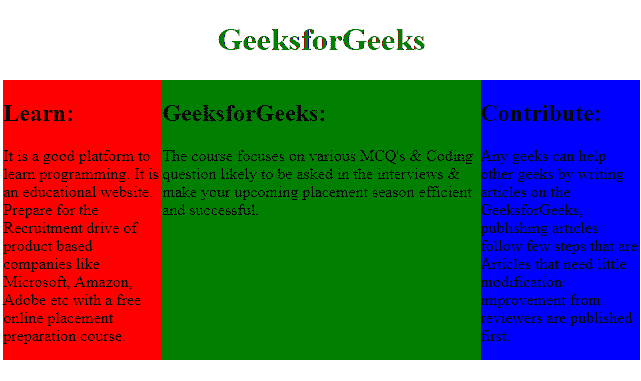
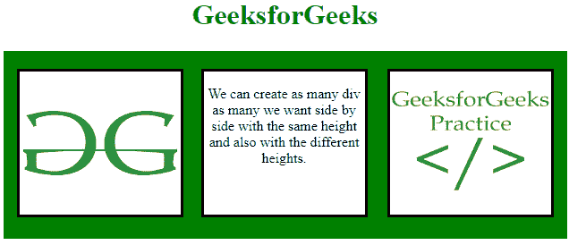
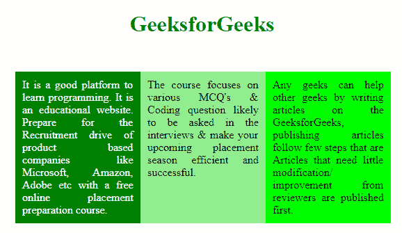

# 如何使用 CSS 并排浮动三个 div？

> 原文:[https://www . geeksforgeeks . org/如何使用-css/](https://www.geeksforgeeks.org/how-to-float-three-div-side-by-side-using-css/) 并排浮动三个 div

使用 CSS 可以并排放置三个或更多不同的 div。使用 CSS 属性设置 div 的高度和宽度，使用 display 属性以并排格式放置 div。

*   **浮动:向左；**此属性用于将在左侧浮动的元素(div)。
*   **浮动:右；**此属性用于将在右侧浮动的元素(div)。

**示例 1:** 本示例使用 float 属性并排放置三个 div。

```
<!DOCTYPE html> 
<html> 
    <head> 

        <!-- CSS property to place div
            side by side -->
        <style> 
            #leftbox {
                float:left; 
                background:Red;
                width:25%;
                height:280px;
            }
            #middlebox{
                float:left; 
                background:Green;
                width:50%;
                height:280px;
            }
            #rightbox{
                float:right;
                background:blue;
                width:25%;
                height:280px;
            }
            h1{
                color:green;
                text-align:center;
            }
        </style> 
    </head> 

    <body> 
        <div id = "boxes">
            <h1>GeeksforGeeks</h1>

            <div id = "leftbox">
                <h2>Learn:</h2>
                It is a good platform to learn programming.
                It is an educational website. Prepare for
                the Recruitment drive  of product based 
                companies like Microsoft, Amazon, Adobe 
                etc with a free online placement preparation 
                course.
            </div> 

            <div id = "middlebox">
                <h2>GeeksforGeeks:</h2>
                The course focuses on various MCQ's & Coding 
                question likely to be asked in the interviews
                & make your upcoming placement season efficient
                and successful.
            </div>

            <div id = "rightbox">
                <h2>Contribute:</h2>
                Any geeks can help other geeks by writing
                articles on the GeeksforGeeks, publishing
                articles follow few steps that are Articles
                that need little modification/improvement
                from reviewers are published first.
            </div>
        </div>
    </body> 
</html>                    
```

**输出:** 

**示例 2:** 本示例使用 float 属性并排放置三个 div。

```
<!DOCTYPE html> 
<html> 
    <head> 

        <!-- CSS style to put div side by side -->
        <style type="text/css"> 
        .container {
            width:600px;
            height:190px;
            background-color:green;
            padding-top:20px;
            padding-left:15px;
            padding-right:15px;
        }
        #st-box {
            float:left;
            width:180px;
            height:160px;
            background-color:white;
            border:solid black;
        }
        #nd-box {
            float:left;
            width:180px;
            height:160px;
            background-color:white; 
            border:solid black;
            margin-left:20px;
        }
        #rd-box {
            float:right;
            width:180px;
            height:160px;
            background-color:white;
            border:solid black;
        }
        h1 {
            color:Green;
        }
        </style> 
    </head> 

    <body>
        <center> 
        <h1>GeeksforGeeks</h1>

        <div class="container">
            <div id="st-box">
                
            </div>

            <div id="nd-box">
                <p>
                    We can create as many div as many we want side by
                    side with the same height and also with the
                    different heights.
                </p>
            </div>

            <div id="rd-box">
                
            </div>
        </div>
        </center>
    </body>
</html>                    
```

**输出:**


**例 3:** 使用 display 属性并排放置三个 div 的另一种方法。

*   **显示:表格；**该属性用于行为类似于表的元素(div)。
*   **显示:表格-单元格；**该属性用于行为类似于 td 的元素(div)。
*   **显示:表-行；**该属性用于行为类似 tr 的元素(div)。

```
<!DOCTYPE html> 
<html> 
    <head> 

        <!-- CSS style to place three div side by side -->
        <style> 
            .container .box { 
                width:540px; 
                margin:50px; 
                display:table; 
            } 
            .container .box .box-row { 
                display:table-row; 
            } 
            .container .box .box-cell { 
                display:table-cell; 
                width:33%; 
                padding:10px; 
            } 
            .container .box .box-cell.box1 { 
                background:green; 
                color:white; 
                text-align:justify; 
            } 
            .container .box .box-cell.box2 { 
                background:lightgreen; 
                text-align:justify 
            } 
            .container .box .box-cell.box3 { 
                background:lime; 
                text-align:justify; 
            }
        </style> 
    </head> 

    <body> 
        <center>
        <h1 style = "color:green;">GeeksforGeeks</h1> 
        <div class="container"> 
            <div class="box"> 
                <div class="box-row"> 
                    <div class="box-cell box1"> 
                        It is a good platform to learn programming.
                        It is an educational website. Prepare for
                        the Recruitment drive of product based
                        companies like Microsoft, Amazon, Adobe etc
                        with a free online placement preparation 
                        course.
                    </div> 

                    <div class="box-cell box2"> 
                        The course focuses on various MCQ's &
                        Coding question likely to be asked in
                        the interviews & make your upcoming
                        placement season efficient and successful. 
                    </div> 

                    <div class="box-cell box3"> 
                        Any geeks can help other geeks by writing
                        articles on the GeeksforGeeks, publishing
                        articles follow few steps that are Articles
                        that need little modification/improvement
                        from reviewers are published first.
                    </div> 
                </div> 
            </div> 
        </div> 
        </center>
    </body> 
</html>                                
```

**输出:**
