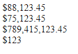

# 如何使用 CSS 将数字格式化为货币？

> 原文:[https://www . geesforgeks . org/如何使用 css 将数字格式化为货币/](https://www.geeksforgeeks.org/how-to-format-a-number-as-currency-using-css/)

给定一个数字，任务是使用 CSS 和一点点 JavaScript 将 HTML 元素的数字格式化为货币。单纯用 CSS 是不可能完成任务的。解析数字时需要一点 JavaScript 来添加逗号。

**方法:**在代码中，CSS 类`currSign`添加了货币符号(比如“{ content }”；)号前。JavaScript 函数`toLocaleString()`返回一个字符串，该字符串带有数字的语言敏感表示。

**示例:**

```html
<!DOCTYPE html>
<html>

<head>
    <meta name="viewport" content=
        "width=device-width, initial-scale=1">

    <!-- CSS style to add the sign of the 
         currency before the number -->
    <style>
        .currSign:before {
            content: '{content}apos;;
        }
    </style>
</head>

<body>
    <!-- Some unformatted numbers -->
    <div class="myDIV">88123.45</div>
    <div class="myDIV">75123.45</div>
    <div class="myDIV">789415123.45</div>
    <div class="myDIV">123</div>

    <!-- Javascript code to format the
         number as per the locale -->
    <script>
        let x = document.querySelectorAll(".myDIV");
        for (let i = 0, len = x.length; i < len; i++) {
            let num = Number(x[i].innerHTML)
                      .toLocaleString('en');
            x[i].innerHTML = num;
            x[i].classList.add("currSign");
        }
    </script>
</body>

</html>
```

**输出:**
