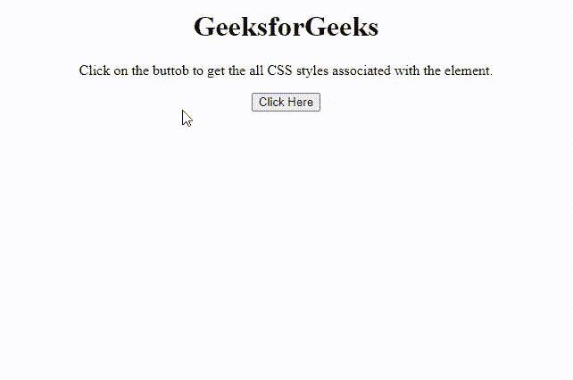
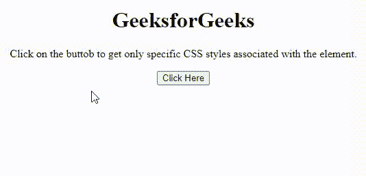

# 如何使用 jQuery 获取一个元素关联的所有 CSS 样式？

> 原文:[https://www . geesforgeks . org/how-to-get-all-CSS-style-associated-an-element-use-jquery/](https://www.geeksforgeeks.org/how-to-get-all-css-styles-associated-with-an-element-using-jquery/)

在本文中，我们将了解如何使用 jQuery 获取与元素关联的应用 CSS 属性，还将通过示例了解其实现。给定一个包含一些 CSS 属性的 HTML 文档，我们需要使用 jQuery 检索特定元素的所有 CSS 样式。这两种方法如下。

**方法 1:** 在这种方法中，我们将使用**document . default view . getcomputed style()**方法来获取与该特定元素相关联的所有级联样式。之后，通过遍历对象将样式逐个附加到字符串中。

详见[HTML DOM default view Property](https://www.geeksforgeeks.org/html-dom-defaultview-property/)&[getcomputed style()**方法**](https://www.geeksforgeeks.org/javascript-window-getcomputedstyle-method/)**。**

****示例:**该示例实现了**document . defaultview . getcomputed style()**方法来检索与特定元素关联的各种应用的样式属性。**

## **超文本标记语言**

```css
<!DOCTYPE HTML>
<html>

<head>
    <title>
       Getting all the CSS styles
       of an element using jQuery
    </title>
</head>

<body style="text-align:center;">
    <h1>GeeksforGeeks</h1>
    <p id="GFG_UP"></p>

    <button onclick="GFG_Fun();"> Click Here </button>
    <p id="GFG_DOWN"></p>

    <script>
    var up = document.getElementById('GFG_UP');
    var down = document.getElementById('GFG_DOWN');
    up.innerHTML = "Click on the buttob "
        + "to get the all CSS styles "
        + "associated with the element.";

    function GFG_Fun() {
        var ar = document.defaultView.getComputedStyle(up, null);
        var str = "";
        for(var key in ar) {
            str = str + key + ': ' + ar[key] + "-";
        }
        down.innerHTML = str;
    }
    </script>
</body>

</html>
```

****输出:****

****

****方法 2:** 在这种方法中，只提取特定的样式。我们可以传递样式的名称。方法 **cssSpecific** 定义为对传递的字符串执行字符串操作，从对象中获取属性，并将它们作为字符串返回。**

****示例:**该示例被实现为仅检索与元素相关联的特定样式属性。**

## **超文本标记语言**

```css
<!DOCTYPE HTML>
<html>

<head>
    <title>
        Getting all the CSS styles
        of an element using jQuery
    </title>
    <script src=
"https://ajax.googleapis.com/ajax/libs/jquery/3.4.0/jquery.min.js">
    </script>
</head>

<body style="text-align:center;">
    <h1>GeeksforGeeks</h1>
    <p id="GFG_UP"></p>

    <button onclick="GFG_Fun();"> Click Here </button>
    <p id="GFG_DOWN"></p>

    <script>
    var up = document.getElementById('GFG_UP');
    var down = document.getElementById('GFG_DOWN');
    up.innerHTML = "Click on the buttob to get"
            + " only specific CSS styles associated "
            + "with the element.";
    (function($) {
        $.fn.cssSpecific = function(str) {
            var ob = {};
            if(this.length) {
                var css = str.split(', ');
                var prms = [];
                for(var i = 0, ii = css.length; i < ii; i++) {
                    prms = css[i].split(':');
                    ob[$.trim(prms[0])] = $(this).css($.trim(prms[1] || prms[0]));
                }
            }
            return ob;
        };
    })(jQuery);

    function GFG_Fun() {
        var styles = $('#GFG_UP').cssSpecific(
'color, backgroundColor, opacity, height, lineHeight:height');
        down.innerHTML = JSON.stringify(styles);
    }
    </script>
</body>

</html>
```

****输出:****

****