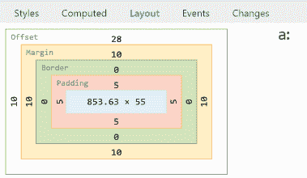
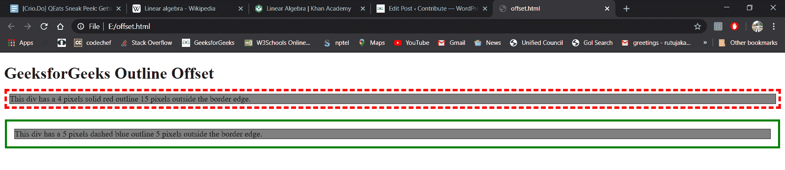

# 如何用 CSS 去掉一个元素偏移量？

> 原文:[https://www . geeksforgeeks . org/如何使用-css/](https://www.geeksforgeeks.org/how-to-get-rid-of-an-element-offset-using-css/) 删除元素偏移量

CSS 有能力让屏幕看起来像开发者的选择。如果没有正确对齐，偏移设置总是会出现问题。由于浏览器默认的 x，y 坐标，可能会出现此问题。

我们将尝试用一个例子来澄清偏移概念。参考下图。

**例:**


**方法:**上图中显示的偏移量是 28，它代表了您的网络浏览器根据元素的位置 CSS 属性为元素估计的 x 和 y 坐标。在任何元素改变偏移量之前插入< br >。例如，您可以通过以下方式将其设置为 0:

**语法:**

```html
#inputBox {
    position: absolute;
    top: 0px;
    left: 0px;
}

```

或者

```html
#inputBox {
    position: relative;
    top: -top margin px;
    left: -left margin px;
}

```

另一个原因可能是导致顶部偏移的`vertical-align: baseline`对`vertical-align: top`。设置`vertical-align: top`，如下所示语法:

**语法:**

```html
position: relative;
top: -top margin px;
left: -left margin px;

```

根据措辞，顶部、左侧、右侧和底部是 CSS 偏移属性(属性)。通常，它们用于将元素定位在所需的位置(使用绝对或固定定位)，或者相对于它们的默认位置移动它们(使用相对定位)。

在上面显示的图像中，我们将把这些值作为-28px 和-10px 来管理语法中的坐标。

```html
#inputBox {
    position: relative;
    top: -28px;
    left: -10px;
}

```

或者

```html
position: relative;
top: -28px;
left: -10px;

```

**输出:**


**完整代码:**

```html
<!DOCTYPE html>
<html>

<head>
    <style>
        div.ex1 {
            margin: 10px;
            border: 1px solid black;
            background-color: grey;
            outline: 5px dashed red;
            outline-offset: 5px;
        }

        div.ex2 {
            margin: 20px;
            border: 1px solid black;
            background-color: grey;
            outline: 4px solid green;
            outline-offset: 15px;
        }
    </style>
</head>

<body>

    <h1>GeeksforGeeks Outline Offset</h1>

    <div class="ex1">
        This div has a 4 pixels solid 
        red outline 15 pixels outside 
        the border edge.
    </div>
    <br>

    <div class="ex2">
        This div has a 5 pixels dashed 
        blue outline 5 pixels outside 
        the border edge.
    </div>
</body>

</html>
```

**输出:**
