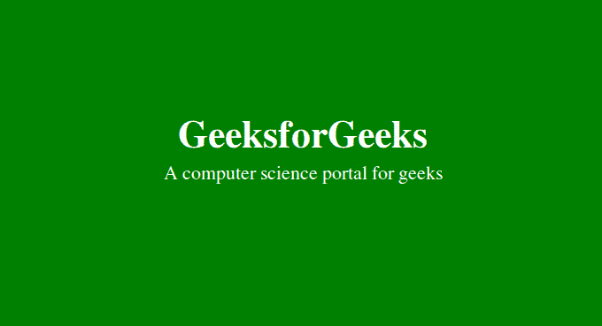

# 如何用 CSS 给一个 div 标签 100%的浏览器窗口高度

> 原文:[https://www . geesforgeks . org/how-to-give-div-tag-100-浏览器窗口高度-使用-css/](https://www.geeksforgeeks.org/how-to-give-a-div-tag-100-height-of-the-browser-window-using-css/)

CSS 允许使用 height 属性调整元素的高度。虽然有几个单位来指定元素的高度。 **vh** 是常用的相对单位。

**vh:** 代表视口高度。视口指的是浏览器窗口的大小。因此，当使用 vh 作为单位时，元素的高度会相对于浏览器窗口(视口)的高度进行调整。
**大众:**代表视口宽度。它用于将浏览器宽度设置为相对于浏览器窗口(视口)宽度的 100%。

**语法:**要将 div 元素高度设置为浏览器窗口的 100%，可以简单地使用 CSS 的以下属性:

```css
height:100vh;
```

**示例:**

```css
<!DOCTYPE html>
<!DOCTYPE html>
<html>
    <head>
        <title>Make div 100% of height</title>
        <style>
            #geeks {
                height: 100vh;
                width: 100vw;
                font-size: 20px;
                font-family: Times;
                padding-top: 250px;                 
                margin: 0px;         
                background-color: green;
                text-align: center;
                color:white;
            }
            .gfg {
                font-size:40px;
                font-weight:bold;
            }
        </style>
    </head>
    <body>
        <div id="geeks">
        <div class = "gfg">GeeksforGeeks</div>
        <div>A computer science portal for geeks</div>
        </div>
    </body>
</html>                    
```

**输出:**
