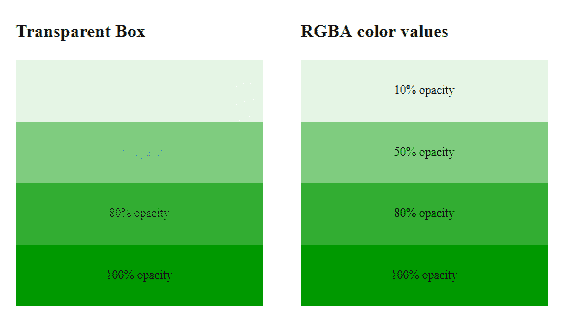

# 如何用 CSS 给文字或图像一个透明的背景？

> 原文:[https://www . geesforgeks . org/how-to-text-or-a-image-transparent-background-use-CSS/](https://www.geeksforgeeks.org/how-to-give-text-or-an-image-transparent-background-using-css/)

在本文中，我们将知道如何使用 CSS 使文本或图像成为透明的背景&将通过示例看到它的实现。[不透明度属性](https://www.geeksforgeeks.org/css-opacity-transparency/)用于使用 CSS 将图像或文本设置为透明。不透明度属性用于调整文本或图片的透明度。不透明度的值介于 0.0 到 1.0 之间，其中低值表示高透明度，高值表示低透明度。不透明度百分比计算为不透明度% =不透明度* 100。不透明度是内容隐藏在元素后面的程度。

**语法:**

```css
element {
    opacity: value;
    // CSS property
}
```

**示例 1:** 该示例通过将不透明度的值设置为 0.3 来将图像描述为透明的。

## 超文本标记语言

```css
<!DOCTYPE html>
<html>

<head>
    <title>Opacity property</title>
    <style>
    .forest {
        opacity: 0.3;
    }

    .opacity {
        padding-top: 300px;
        text-align: center;
    }

    body {
        background: url(
"https://media.geeksforgeeks.org/wp-content/uploads/20211103124244/wind-300x193.jpg") 
                no-repeat;
        background-size: cover;
        background-size: 290px 220px;
    }

    .forest {
        width: 220px;
        height: 90px;
        position: absolute;
        top: 20%;
        left: 20%;
        transform: translate(-50%, -50%);
    }
    </style>
</head>

<body>
    <div class="opacity"> 
        
    </div>
</body>

</html>
```

**输出:**


**示例 2:** 本示例使用不同的 rgba 颜色值将文本描述为透明的。

## 超文本标记语言

```css
<!DOCTYPE html>
<html>

<head>
    <title>Transparent box</title>
    <style>
    .geeks {
        background: rgb(0, 153, 0);
        padding: 15px;
        text-align: center;
        width: 300px;
    }

    #geek {
        padding: 15px;
        text-align: center;
        width: 300px;
    }

    .rgba1 {
        background: rgba(0, 153, 0, 0.1);
    }

    .rgba2 {
        background: rgba(0, 153, 0, 0.5);
    }

    .rgba3 {
        background: rgba(0, 153, 0, 0.8);
    }

    .rgba4 {
        background: rgba(0, 153, 0, 1.0);
    }

    .g1 {
        float: left;
        margin-left: 50px;
    }

    .g2 {
        margin-top: -40px;
        margin-left: 50px;
        float: left;
    }
    </style>
</head>

<body>
    <div class="g1">
        <p style="font-size:24px;font-weight:bold;">Transparent Box</p>

        <div class="geeks" style="opacity:0.1;">
            <p>10% opacity</p>

        </div>
        <div class="geeks" style="opacity:0.5;">
            <p>50% opacity</p>

        </div>
        <div class="geeks" style="opacity:0.8;">
            <p>80% opacity</p>

        </div>
        <div class="geeks">
            <p>100% opacity</p>

        </div>
    </div>
    <br>
    <br>
    <div class="g2">
        <p style="font-size:24px;font-weight:bold;">RGBA color values</p>

        <div class="rgba1" id="geek">
            <p>10% opacity</p>

        </div>
        <div class="rgba2" id="geek">
            <p>50% opacity</p>

        </div>
        <div class="rgba3" id="geek">
            <p>80% opacity</p>

        </div>
        <div class="rgba4" id="geek">
            <p>100% opacity</p>

        </div>
    </div>
</body>

</html>
```

