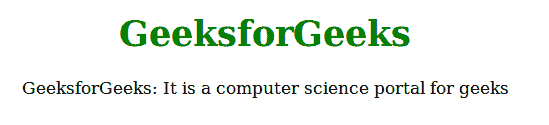
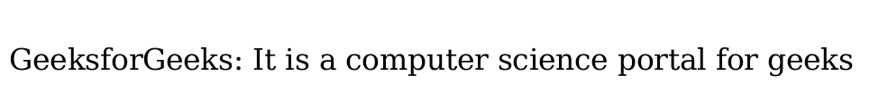
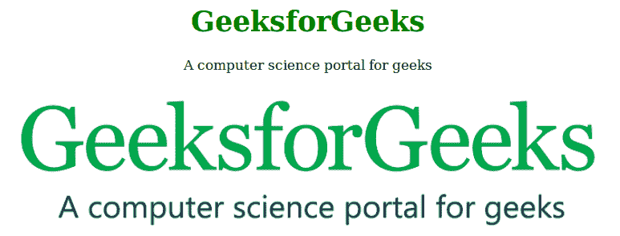

# 使用 CSS 打印网页时如何隐藏一个元素？

> 原文:[https://www . geeksforgeeks . org/如何在使用 css 打印网页时隐藏元素/](https://www.geeksforgeeks.org/how-to-hide-an-element-when-printing-a-web-page-using-css/)

媒体查询用于在打印网页时隐藏元素。使用@media print 查询，并将可见性设置为在打印时需要隐藏的元素。

**示例 1:** 在本示例中，在打印时隐藏元素 h1。要隐藏元素 h1，请使用媒体查询并设置可见性:隐藏。

## 超文本标记语言

```html
<!DOCTYPE html>
<html>
    <head>
        <title>Hide element at print</title>
        <style>
            body {
                text-align:center;
            }
            h1 {
                color:green;
            }
            @media print {
               .noprint {
                  visibility: hidden;
               }
            }
        </style>
    </head>
    <body>
        <h1 class = "noprint">GeeksforGeeks</h1>

<p>GeeksforGeeks: It is a computer science
        portal for geeks</p>

    </body>
</html>                                     
```

**输出:**
**打印页面前:**



**打印完页面后:**



**示例 2:** 在本例中，打印网页时使用媒体查询隐藏图像元素。

## 超文本标记语言

```html
<!DOCTYPE html>
<html>
    <head>
        <title>Hide element at printing</title>
        <style>
            body {
                text-align:center;
            }
            h1 {
                color:green;
            }
            @media print {
               img {
                  visibility: hidden;
               }
            }
        </style>
    </head>
    <body>
        <h1>GeeksforGeeks</h1>

<p>A computer science portal for geeks</p>

        
        <style>
            .noprint {
                visibility: hidden;
            }
            </style>
    </body>
</html>                   
```

**输出:**
**打印页面前:**



**打印完页面后:**

