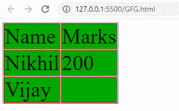
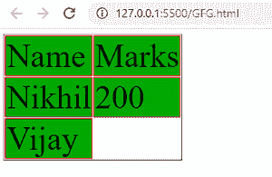

# 如何用 CSS 隐藏表格中空单元格的边框和背景？

> 原文:[https://www . geeksforgeeks . org/如何使用-css 隐藏表格中空单元格的边框和背景/](https://www.geeksforgeeks.org/how-to-hide-border-and-background-on-empty-cells-in-a-table-using-css/)

在本文中，我们将学习如何使用 CSS 隐藏表格中空白单元格的边框和背景。CSS 的[空单元格属性](https://www.geeksforgeeks.org/css-empty-cells-property/)用于隐藏空单元格上的边框和背景。

**方法:**CSS 的**空单元格**属性用于隐藏空单元格上的边框和背景。为了隐藏空单元格的边框和背景，我们将空单元格的值设置为隐藏，这将隐藏空单元格的边框和背景。

**语法:**

```css
empty-cells: hide;
```

**例**

## 超文本标记语言

```css
<!DOCTYPE html>
<html lang="en">

<head>
    <style>
        .gfg {
            font-size: 50px;
            empty-cells: hide;
        }

        td,
        th {
            background-color: rgb(0, 168, 0);
            border: solid 1px red;
        }
    </style>
</head>

<body>
    <table class="gfg" border="1">
        <tr>
            <td>Name</td>
            <td>Marks</td>
        </tr>

        <tr>
            <td>Nikhil</td>
            <td>200</td>
        </tr>

        <tr>
            <td>Vijay</td>
            <td></td>
        </tr>
    </table>
</body>

</html>
```

**输出:**

**应用空单元格属性前:**



**应用空单元格属性后:**

