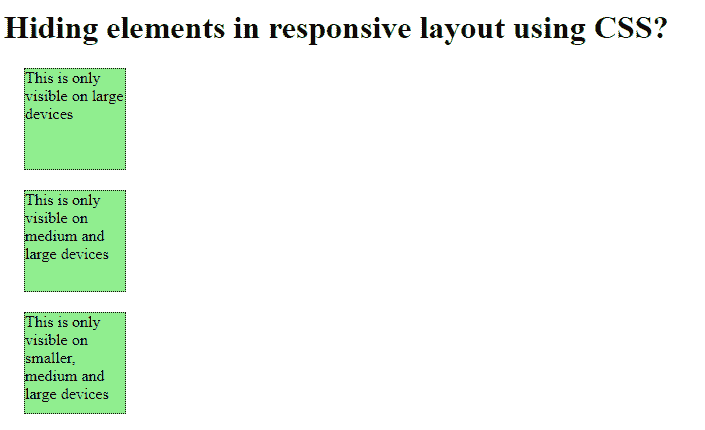
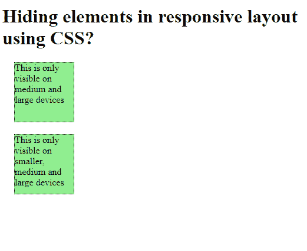
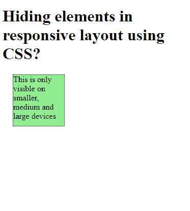

# 如何使用 CSS 隐藏响应布局中的元素？

> 原文:[https://www . geesforgeks . org/how-hide-elements-in-responsive-layout-use-CSS/](https://www.geeksforgeeks.org/how-to-hide-elements-in-responsive-layout-using-css/)

CSS 可以用来隐藏或显示页面的元素。这可以用于响应性网站，以显示某些元素，这些元素只能与更大的屏幕尺寸进行交互，以获得良好的用户体验。

媒体查询是 CSS3 中引入的技术，用于帮助设计响应性网站。媒体查询有两个部分，一个是可选的媒体类型，它有助于描述媒体查询将工作的设备的一般类别。另一个是媒体功能，它描述了要显示页面的设备的特定特征。可以测试它们的价值，从而相应地改变页面内容的行为。

这里使用的媒体类型是 screen，它与“only”关键字一起使用，因此媒体查询只影响选定的屏幕。媒体功能可以根据宽度进行更改。例如，它可以与宽度媒体功能一起使用。当宽度设置为特定值(如使用最小宽度和最大宽度)时，可以对其进行修改。其他受支持的媒体功能可用于检查有助于响应网站的值。

**语法:**

```html
// Check if the height is at least 600px
@media only screen and (min-width: 600px) {
    .large {
        display: block;
    }
}
```

在本例中，通过将“显示”属性设置为“无”来隐藏元素。媒体查询包含将**显示属性**设置为**块示例:**

```html
<!DOCTYPE html>
<html>

<head>
    <title>
        How to hide elements in responsive
        layout using CSS?
    </title>

    <style>
        .box {
            margin: 20px;
            border: 1px dotted;
            height: 100px;
            width: 100px;
            background-color: lightgreen;
            display: none;
        }

        /* Check if the screen size is at least 600px */
        @media only screen and (min-width: 600px) {
            .lg {
                display: block;
            }
        }

        /* check if the screen size is at least 400px */
        @media only screen and (min-width: 400px) {
            .md {
                display: block;
            }
        }

        /* check if the screen size is at least 100px */
        @media only screen and (min-width: 100px) {
            .sm {
                display: block;
            }
        }
    </style>
</head>

<body>
    <h1>
        Hiding elements in responsive
        layout using CSS?
    </h1>

    <div class="box lg">
        This is only visible on
        large devices
    </div>

    <div class="box md">
        This is only visible on
        medium and large devices
    </div>

    <div class="box sm">
        This is only visible on smaller,
        medium and large devices
    </div>
</body>

</html>
```

**输出:**

*   **当屏幕大小至少为 600px 时:**
    
*   **当屏幕大小至少为 400px 时:**
    
*   **当屏幕大小至少为 100px 时:**
    