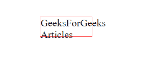
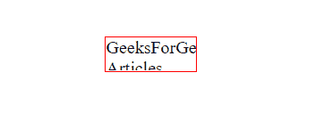

# 如何使用 CSS 隐藏超出 DIV 元素的文本？

> 原文:[https://www . geesforgeks . org/how-hide-text-超越-div-element-use-CSS/](https://www.geeksforgeeks.org/how-to-hide-text-going-beyond-div-element-using-css/)

在本文中，我们将学习如何使用 CSS 隐藏超出 DIV 元素的文本。当 DIv 元素的高度和宽度很小时，基本上会出现这个问题，这样所有的文本都不能放在那个 DIV 中。



文本外出

在这里，DIV 元素的区域由红色边框显示，我们可以清楚地看到文本正在超越它。

我们可以通过使用 CSS [溢出](https://www.geeksforgeeks.org/css-overflow/)属性来解决这个问题。

> 溢出:隐藏；
> 隐藏–溢出被剪切，其余内容将不可见。

示例:

```html
.gfg{
    height: 50px;
    width: 100px;
    overflow: hidden;
}
```

**代码实现:**

## 超文本标记语言

```html
<!DOCTYPE html>
<html lang="en">

<!-- Adding css -->
<style>
    .gfg {
        margin: 50px auto;
        width: 80px;
        height: 30px;
        border: 1px solid red;
        overflow: hidden;
    }
</style>

<body>
    <div class="gfg">
        GeeksForGeeks Articles
    </div>
</body>

</html>
```

**输出:**



溢出项目被隐藏