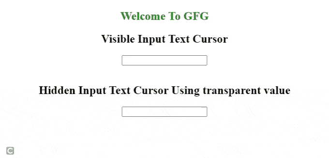

# 如何使用 CSS 隐藏网页中的插入插入符号？

> 原文:[https://www . geeksforgeeks . org/如何使用 css 隐藏网页中的插入符号/](https://www.geeksforgeeks.org/how-to-hide-the-insertion-caret-in-a-webpage-using-css/)

插入插入符号或文本输入光标通常指闪烁的细垂直线。它在输入字段中起作用，指示键入的下一个字符将被插入的位置。

如果您希望在网页的输入栏中隐藏该输入光标，则使用 CSS 的 [*【插入符号-颜色】*](https://www.geeksforgeeks.org/css-caret-color-property/) 属性。它有三个属性值，包括*自动、颜色、*和*透明。*在本文中，我们将重点讨论*透明的*值。

**语法:**

```
caret-color: transparent;
```

**示例:**以下示例使用 CSS 隐藏文本输入光标。

## 超文本标记语言

```
<!DOCTYPE html>
<html>

<head>
    <title>Hide insertion caret</title>
    <style>
        body {
            text-align: center;
        }

        .hidden {
            caret-color: transparent;
        }
    </style>
</head>

<body>
    <h2 style="color:green;">Welcome To GFG</h2>
    <h2> Visible Input Text Cursor </h2>
    <input type="text"><br><br>
    <h2> Hidden Input Text Cursor Using
        <b>transparent</b> value
    </h2>
    <input type="text" class="hidden">
</body>

</html>
```

**输出:**



隐藏光标