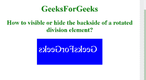
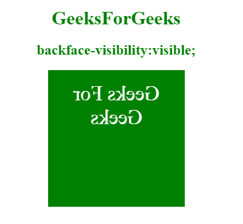

# 如何使用 CSS 隐藏/可见旋转 div 元素的背面？

> 原文:[https://www . geeksforgeeks . org/如何使用 css 隐藏旋转 div 元素的可见背面/](https://www.geeksforgeeks.org/how-to-hide-visible-the-backside-of-a-rotated-div-element-using-css/)

本文的方法是在 CSS 中使用 **[背面可见性属性](https://www.geeksforgeeks.org/css-backface-visibility-property/)** 来显示或隐藏元素旋转时的背面。它是正面的镜像，作为元素的背面显示给用户。当一个元素被旋转时，它很有用，然后它决定一个元素的背面是否可见。

**语法:**

```css
backface-visibility: visible | hidden | initial | inherit;
```

**示例:**下面的代码用来显示旋转了 180 度的< div >元素的背面。

```css
<!DOCTYPE html>
<html>

<head>
    <style>
        div {
            position: relative;
            height: 60px;
            width: 210px;
            font-size: 35PX;
            color: white;
            text-align: center;
            padding: 20px;
            background-color: blue;
            -webkit-transform: rotateY(180deg);
            transform: rotateY(180deg);
        }

        #GFG {
            -webkit-backface-visibility: visible
        }
    </style>
</head>

<body>
    <center>
        <h1 style="color:green;">GeeksForGeeks</h1>
        <h2 style="color:green;">
            How to visible or hide the backside
            of a rotated division element?
        </h2>
        <div id="GFG">GeeksForGeeks</div>
    </center>
</body>

</html>        
```

**输出:**



**例 2:**

```css
<!DOCTYPE html>
<html>

<head>
    <style>
        div {
            position: relative;
            height: 190px;
            width: 190px;
            font-size: 35px;
            color: white;
            text-align: center;
            padding: 20px;
            background-color: green;
            -webkit-transform: rotateY(180deg);
            transform: rotateY(180deg);
        }

        #GEEKS {
            -webkit-backface-visibility: hidden;
            backface-visibility: hidden;
        }
    </style>
</head>

<body>
    <center>
        <h1 style="color:green;">
            GeeksForGeeks
        </h1>

        <h2 style="color:green;">
            backface-visibility:visible;
        </h2>

        <div id="Gfg">Geeks For Geeks</div>
    </center>
</body>

</html>    
```

**输出:**


**支持的浏览器:**

*   谷歌 Chrome
*   微软公司出品的 web 浏览器
*   火狐浏览器
*   歌剧
*   旅行队