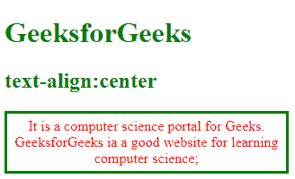

# 如何用 CSS 水平居中一个 div？

> 原文:[https://www . geesforgeks . org/how-to-横置-居中-a-div-using-css/](https://www.geeksforgeeks.org/how-to-horizontally-center-a-div-using-css/)

在本文中，我们将了解如何使用 CSS 水平居中 div。

将[T2>元素水平居中:](https://www.geeksforgeeks.org/div-tag-html/)

*   我们可以使用设置为自动的边距属性，即边距:自动；。
*   < **div** >元素占用其指定的宽度，并通过左右边距平均分配剩余空间。

我们可以设置元素的宽度，防止它延伸到容器的边缘。在这种情况下，元素将采用指定的宽度&剩余的空间将在两个边距之间平分。如果宽度设置为 0 或 100%，则中心对齐不适用于元素。

**示例:**此示例描述了边距的使用:自动将块元素水平居中。

## 超文本标记语言

```
<!DOCTYPE html>
<html>

<head>
    <title> How to horizontally center a div using CSS </title>
    <style>
    div {
        width: 300px;
        margin: auto;
        padding: 5px;
        border: 3px solid green;
        color: red;
    }

    h1,
    h2 {
        text-align: center;
        color: green;
    }
    </style>
</head>

<body>
    <h1>GeeksforGeeks</h1>
    <h2>margin:auto</h2>
    <div>
        It is a computer science portal for Geeks.
        GeeksforGeeks ia a good website for learning
        computer science.
    </div>
</body>

</html>
```

**输出:**


**示例:**本示例描述了使用文本对齐:居中将文本定位到中心。

## 超文本标记语言

```
<!DOCTYPE html>
<html>

<head>
    <title> How to horizontally center a div using CSS </title>
    <style>
    div {
        width: 300px;
        padding: 5px;
        border: 3px solid green;
        color: red;
        text-align: center;
    }

    h1,
    h2 {
        color: green;
    }
    </style>
</head>

<body>
    <h1>GeeksforGeeks</h1>
    <h2>text-align:center</h2>
    <div>
        It is a computer science portal for
        Geeks. GeeksforGeeks ia a good website
        for learning computer science;
    </div>
</body>

</html>
```

**输出:**



我们可以使用 CSS [位置属性](https://www.geeksforgeeks.org/css-positioning-elements/)水平居中对齐一个 div。

**示例:**本示例描述了使用 position 属性来对齐水平中心。

## 超文本标记语言

```
<!DOCTYPE html>
<html>

<head>
    <title> How to horizontally center a div using CSS </title>
    <style>
    div {
        width: 300px;
        padding: 5px;
        border: 3px solid green;
        color: red;
        position: absolute;
    }

    h1,
    h2 {
        color: green;
    }
    </style>
</head>

<body>
    <h1>GeeksforGeeks</h1>
    <h2>position: absolute</h2>
    <div>
        It is a computer science portal for
        Geeks. GeeksforGeeks ia a good website
        for learning computer science;
    </div>
</body>

</html>
```