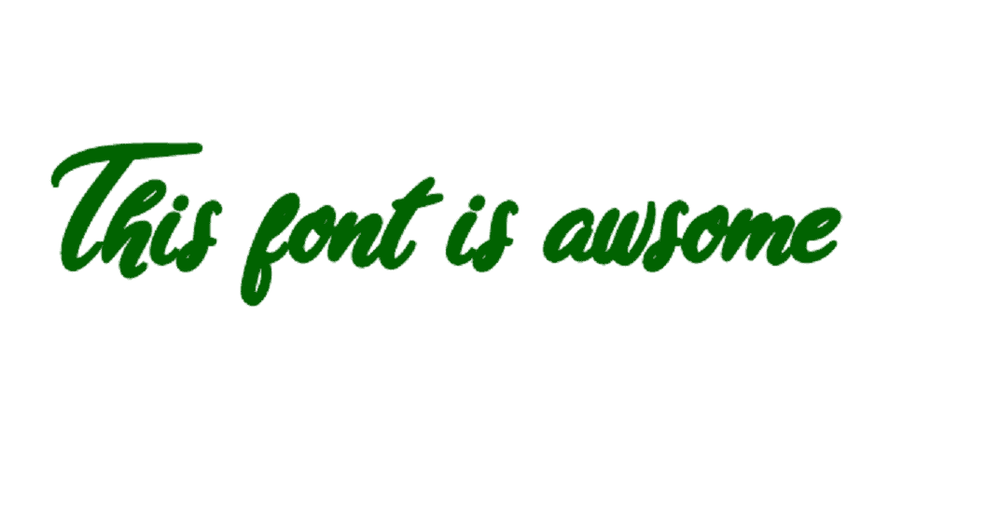
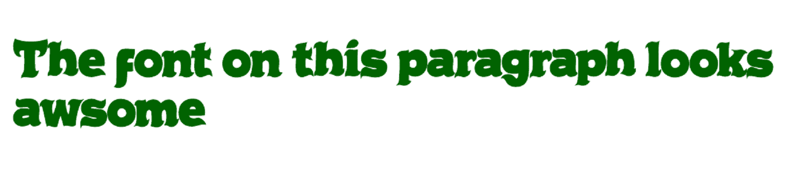

# 如何包含字体。使用 CSS 的 ttf？

> 原文:[https://www . geesforgeks . org/how-to-include-a-font-TTF-using-CSS/](https://www.geeksforgeeks.org/how-to-include-a-font-ttf-using-css/)

**添加。使用 CSS 的 ttf 字体:**20 世纪 80 年代末，在被 adobe 的 type 1 字体打败后，苹果想出了一种新的字体格式类型，那就是。真实字体。这些字体是如此令人敬畏，以至于它们在很短的时间内成为世界上最常见的字体格式。事实上，windows 本身就开始在那里的操作系统中使用它们。

然后，如果您希望在您的网页中使用这些字体格式，这里有一个详细的逐步解释，如何导入和使用。使用 CSS 的 Html 中的 ttf(真实类型字体)。

**1。下载。ttf 格式文件:****。如今 ttf 格式相当出名，这些字体文件在 Google 上是免费提供的。你可以访问字体空间、字体松鼠等免费提供这些字体的网站。将所有文件保存在同一个文件夹中。**

****2。创建一个 HTML 文件:**创建一个 HTML 文件，并添加一个 h2 标签来演示我们的字体样式。**

## **超文本标记语言**

```html
<!DOCTYPE html>
<html lang="en">
<head>
    <meta charset="UTF-8">
    <meta name="viewport" content=
          "width=device-width, initial-scale=1.0">
    <link rel="stylesheet" href="style.css">
</head>
<body>
    <h2>This font is awesome</h2>
</body>
</html>
```

****3。创建一个 CSS 文件:**对于通过 CSS 添加外部字体，我们使用@Font-face 属性属性手动定义字体名称并给出源文件。之后，我们可以在字体系列属性所需的任何元素中访问我们定义的字体。** 

```html
@font-face {
    font-family: myFirstFont;
    src: url(ArianaVioleta-dz2K.ttf);
}

h2 {
    font-family: myFirstFont;
    color: darkgreen;
}
```

****最终结果:**这是我们的字体在浏览器上的外观**

**

浏览器中的字体** 

**如果在上面的例子中你没有抓住这个想法，让我们尝试另一种字体样式。**

****HTML 文件:****

## **超文本标记语言**

```html
<!DOCTYPE html>
<html lang="en">
<head>
    <meta charset="UTF-8">
    <meta name="viewport" content=
          "width=device-width, initial-scale=1.0">
    <link rel="stylesheet" href="style.css">
</head>
<body>

<p>The font on this paragraph looks awesome</p>

</body>
</html>
```

****CSS 文件:**T2]**

```html
@font-face {
   font-family: myFirstFont;
   src: url(ChrustyRock-ORLA.ttf);
}

h2 {
   font-family: myFirstFont;
   color: darkgreen;
}
```

****输出:****

**

使用新字体的第二个示例** 

****支持的浏览器:****

*   **谷歌 Chrome**
*   **微软公司出品的 web 浏览器**
*   **火狐浏览器**
*   **歌剧**
*   **旅行队**