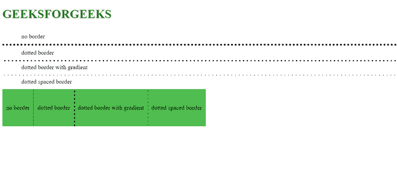

# 如何用 CSS 增加点状边框点之间的间距？

> 原文:[https://www . geeksforgeeks . org/如何使用-css/](https://www.geeksforgeeks.org/how-to-increase-the-space-between-dotted-border-dots-using-css/) 增加点边框点间距

任务是增加点状边框点之间的间距。您可以使用背景大小属性调整大小，使用背景图像属性调整比例，使用线性渐变百分比调整比例。因此，您可以使用多种背景拥有多个虚线边框。在这个例子中，我们有一条由 3px 点和 7px 间距组成的虚线。

**语法:**

这适用于水平和垂直边框:

*   **Horizontal**

    > Background image: linear gradient (right, black 30%, RGBA (255,255,255,0) 0%);
    > Background size: 10px 3px

*   **Vertical**

    > Background image: linear gradient (black 33%, RGBA (255,255,255,0) 0%);
    > Background size: 3px 10px

让我们看看这个例子，它适用于水平和垂直边框。

增加点状边框点间距的示例:

下面给出的文件包含 CSS 属性。此文件用保存。css 扩展。例如:

**style.css**

```html
<style>
    div {
        padding: 10px 50px;
    }
    h1 {
        color: rgb(20, 117, 8);
    }
    .dotted {
        border-top: 5px #000 dotted;
    }
    .dotted-gradient {
        background-image: 
linear-gradient(to right, #000 30%, rgba(255, 255, 255, 0) 10%);
        background-position: top;
        background-size: 10px 3px;
        background-repeat: repeat-x;
    }
    .dotted-spaced {
        background-image: 
linear-gradient(to right, #000 10%, rgba(255, 255, 255, 0) 0%);
        background-position: top;
        background-size: 10px 3px;
        background-repeat: repeat-x;
    }
    .left {
        float: left;
        padding: 40px 10px;
        background-color: rgb(79, 189, 79);
    }
    .left.dotted {
        border-left: 1px #000 dotted;
        border-top: none;
    }
    .left.dotted-gradient {
        background-image: 
linear-gradient(to bottom, #000 40%, rgba(255, 255, 255, 0) 10%);
        background-position: left;
        background-size: 3px 10px;
        background-repeat: repeat-y;
    }
    .left.dotted-spaced {
        background-image: 
linear-gradient(to bottom, #000 10%, rgba(255, 255, 255, 0) 0%);
        background-position: left;
        background-size: 3px 10px;
        background-repeat: repeat-y;
    }
</style>
```

下面是利用创建的外部样式表的 HTML 文件。

*   链接标签用于链接外部样式表和 HTML 网页。

```html
<!DOCTYPE html>
<html>
    <head>
        <title>GEEKSFORGEEKS</title>
          <link rel="stylesheet" 
                type="text/css" 
                href="style.css">
    </head>
    <body>
        <h1>GEEKSFORGEEKS</h1> 
        <div>no border</div>
        <div class='dotted'>dotted border</div>
        <div class='dotted-gradient'>
             dotted border with gradient</div>
        <div class='dotted-spaced'>
             dotted spaced border</div>
        <div class='left'>no border</div>
        <div class='dotted left'>dotted border</div>
        <div class='dotted-gradient left'>
             dotted border with gradient</div>
        <div class='dotted-spaced left'>
             dotted spaced border</div>
    </body>
</html>
```

**完整代码:**

```html
<!DOCTYPE html>
<html>
    <head>
        <title>GEEKSFORGEEKS</title>
        <style>
            div {
                padding: 10px 50px;
            }
            h1 {
                color: rgb(20, 117, 8);
            }
            .dotted {
                border-top: 5px #000 dotted;
            }
            .dotted-gradient {
                background-image: 
linear-gradient(to right, #000 30%, rgba(255, 255, 255, 0) 10%);
                background-position: top;
                background-size: 10px 3px;
                background-repeat: repeat-x;
            }
            .dotted-spaced {
                background-image: 
linear-gradient(to right, #000 10%, rgba(255, 255, 255, 0) 0%);
                background-position: top;
                background-size: 10px 3px;
                background-repeat: repeat-x;
            }
            .left {
                float: left;
                padding: 40px 10px;
                background-color: rgb(79, 189, 79);
            }
            .left.dotted {
                border-left: 1px #000 dotted;
                border-top: none;
            }
            .left.dotted-gradient {
                background-image: 
linear-gradient(to bottom, #000 40%, rgba(255, 255, 255, 0) 10%);
                background-position: left;
                background-size: 3px 10px;
                background-repeat: repeat-y;
            }
            .left.dotted-spaced {
                background-image: 
linear-gradient(to bottom, #000 10%, rgba(255, 255, 255, 0) 0%);
                background-position: left;
                background-size: 3px 10px;
                background-repeat: repeat-y;
            }
        </style>
    </head>
    <body>
        <h1>GEEKSFORGEEKS</h1>
        <div>no border</div>
        <div class="dotted">dotted border</div>
        <div class="dotted-gradient">
          dotted border with gradient</div>
        <div class="dotted-spaced">
          dotted spaced border</div>
        <div class="left">no border</div>
        <div class="dotted left">dotted border</div>
        <div class="dotted-gradient left">
          dotted border with gradient</div>
        <div class="dotted-spaced left">
          dotted spaced border</div>
    </body>
</html>
```

**输出看起来像**:



输出