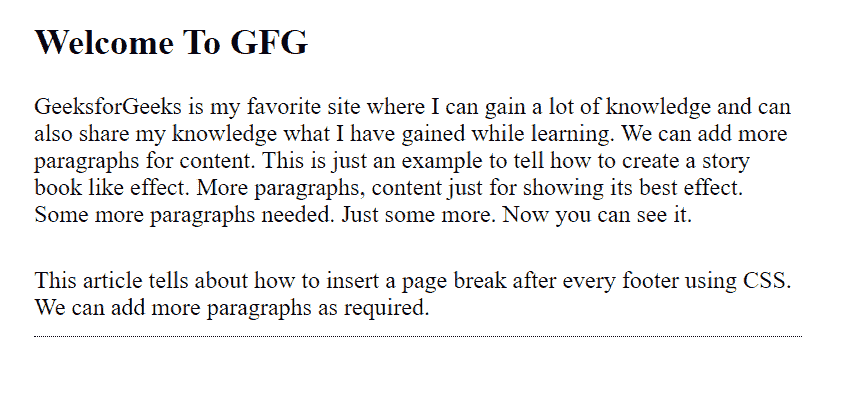

# 如何在 CSS 中的每个页脚元素后插入分页符？

> 原文:[https://www . geesforgeks . org/如何在 css 中的每个页脚元素后插入分页符/](https://www.geeksforgeeks.org/how-to-insert-a-page-break-after-each-footer-element-in-css/)

**CSS** 用于设计网页，使其对用户来说更加美观和有吸引力。

在每个页脚后插入分页符后，使用 CSS[](https://www.geeksforgeeks.org/css-page-break-after-property/)*属性后分页符会更好看，也避免了重复。*

***语法:***

```css
*.foot {
    page-break-after: always;
}*
```

*分页后提供了更多的属性值:*

*   *分页后:自动；*
*   *分页后:始终；*
*   *分页后:避免；*
*   *分页后:左侧；*
*   *分页后:对；*
*   *分页后:recto*

***示例:**要在每个页脚或指定元素后插入分页符，我们使用属性*分页符后:始终；**

## *超文本标记语言*

```css
*<!DOCTYPE html>
<html>

<head>
    <style type="text/css">
        .footer {
            margin: 10px 0 0 0;
            padding: 10px 0;
            border-bottom: 1px dotted Black;
            page-break-after: always;
        }

        body {
            font-size: 1rem;
            width: 40%;
            margin: auto;
            font-family: cormorant infant;
        }
    </style>
</head>

<body>
    <h2>Welcome To GFG</h2>

    <p>
        GeeksforGeeks is my favorite site where
        I can gain a lot of knowledge and can
        also share my knowledge what I have
        gained while learning. We can add more
        paragraphs for content. This is just an
        example to tell how to create a story
        book like effect. More paragraphs,
        content just for showing its best effect.
        Some more paragraphs needed. Just some
        more. Now you can see it.
    </p>

    <div class="footer">
        This article tells about how to insert a
        page break after every footer using CSS.
        We can add more paragraphs as required.
    </div>
</body>

</html>*
```

***输出:***

**

*我们在每个页脚后插入了分页符，这将吸引读者阅读网页上的内容。*