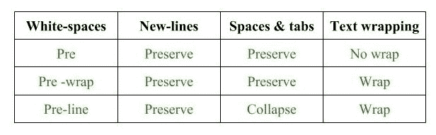
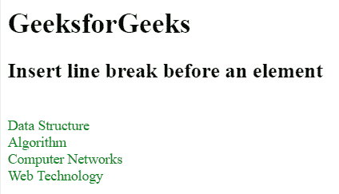
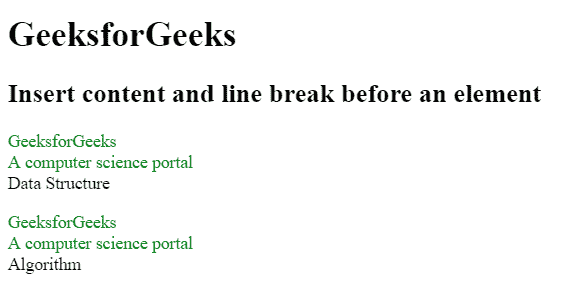
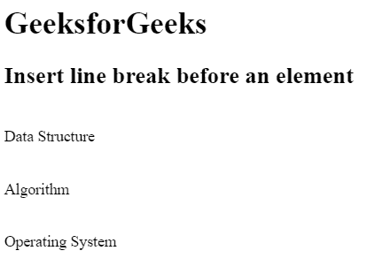

# 如何使用 CSS 在元素前插入换行符？

> 原文:[https://www . geesforgeks . org/如何使用-css 在元素前插入换行符/](https://www.geeksforgeeks.org/how-to-insert-line-break-before-an-element-using-css/)

空白属性用于在元素前插入换行符。此属性控制文本换行和空白。


**行与行之间的换行符:**可以在文本行之间添加换行符。空白:前奏曲；用于在元素前插入换行符。

**例 1:**

```
<!DOCTYPE html>
<html>

<head>
    <title>
        Insert line break
        before an element
    </title>

    <!-- CSS style to insert line break
        before an element -->
    <style>
        p { 
            color:green;
            white-space: pre-line;
        }
    </style>
</head>

<body>
    <h1>GeeksforGeeks</h1>

    <h2>
        Insert line break before an 
        element
    </h2>

    <p>
        Data Structure
        Algorithm
        Computer Networks
        Web Technology
    </p>
</body>

</html>                    
```

**输出:**


**HTML 元素之间的换行符:**HTML 元素之间的换行符可以使用 CSS 属性添加。有两种方法可以强制内联元素添加新行。

*   **使用显示属性:**块级元素从新的一行开始，并占据其可用的整个宽度。
*   **使用回车符(\A):** 我们可以通过使用::before 或::after 伪元素来添加新行。

**例 2:**

```
<!DOCTYPE html>
<html>

<head>
    <title>
        Insert line break and content
        before an element
    </title>

    <!--It adds the GeeksforGeeks
        A computer science portal -->
    <style>
        p::before {
            color:green;
            content: "GeeksforGeeks \A "
                "A computer science portal";
            display: block;
            white-space: pre;
        }
    </style>
</head>

<body>
    <h1>GeeksforGeeks</h1>

    <h2>
        Insert content and line break
        before an element
    </h2>

    <p>Data Structure</p>
    <p>Algorithm</p>
</body>

</html>                    
```

**输出:**


**示例 3:** 本示例使用回车符“\A”在元素前添加换行符。

```
<!DOCTYPE html>
<html>

<head>
    <title>
        Insert line break
        before an element
    </title>

    <!-- Style to add the line break -->
    <style>
        p::before {
            content: "\A";
            white-space: pre;
        }
    </style>
</head>

<body>
    <h1>GeeksforGeeks</h1>

    <h2>
        Insert line break
        before an element
    </h2>

    <p>Data Structure</p>
    <p>Algorithm</p>
    <p>Operating System</p>
</body>

</html>                    
```

**输出:**
