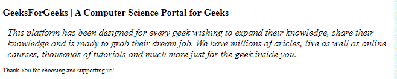

# CSS 中的文字如何斜体？

> 原文:[https://www.geeksforgeeks.org/how-to-italicize-text-in-css/](https://www.geeksforgeeks.org/how-to-italicize-text-in-css/)

在本文中，我们将看到如何使用 CSS 使文本倾斜。使用 CSS [*字体样式的*](https://www.geeksforgeeks.org/css-font-style-property/) 属性对任何网页中的文本进行斜体处理。我们有多种选项可以将其设置为斜体文本。

*   **正常:**是正常的字体样式。它与 400 相同，400 是粗体的默认数值。
*   **加粗:**它**T3】就是加粗的字体风格。和 700 一样。**
*   **斜体:**为草书体。

**方法:**CSS 中 [*字体样式*](https://www.geeksforgeeks.org/css-font-style-property/) 属性有三个值，分别是*普通、斜体、*和*粗体。*CSS 值*斜体*用于文本的斜体。

**语法:**

```html
font-style: italic;
```

**示例:**

## 超文本标记语言

```html
<!DOCTYPE html>
<html lang="en">

<head>
    <meta charset="UTF-8" />
    <meta http-equiv="X-UA-Compatible" content="IE=edge" />

    <meta name="viewport" content=
        "width=device-width, initial-scale=1.0" />

    <!--Style CSS-->
    <style>
        .gfg {
            font-style: italic;
            font-size: 24px;
            margin: 10px;
            padding: 2px;
            color: black;
        }
    </style>
</head>

<body>
    <h2>
        GeeksForGeeks | A Computer Science 
        Portal for Geeks
    </h2>

    <p class="gfg">
        This platform has been designed for 
        every geek wishing to expand their
        knowledge, share their knowledge and 
        is ready to grab their dream job. We
        have millions of articles, live as 
        well as online courses, thousands of
        tutorials and much more just for the 
        geek inside you.
    </p>

    <p class="geeks">
        Thank You for choosing and supporting us!
    </p>
</body>

</html>
```

**注意:**当你将使用一个外部的 CSS 文件时，总是为你的网页使用一些默认的 CSS，这个默认的 CSS 写在* { }选择器中。这将从您的网页中删除默认的 CSS。

**输出:**现在，正如你在输出中看到的，我们已经使用 CSS 在我们的网页中创建了一个**斜体**文本，这将吸引读者阅读网页上的内容。

