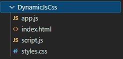
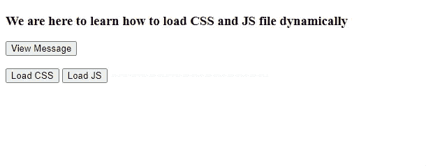

# 如何动态加载 CSS 和 JS 文件？

> 原文:[https://www . geesforgeks . org/如何动态加载 css 和 js 文件/](https://www.geeksforgeeks.org/how-to-load-css-and-js-files-dynamically/)

一般来说 [CSS](https://www.geeksforgeeks.org/css-tutorials/) 和 [JS](https://www.geeksforgeeks.org/javascript-tutorial/) 文件都是用 HTML 代码静态包含的。这意味着它们写在[脚本](https://www.geeksforgeeks.org/html-script-tag/)或 [HTML 代码](https://www.geeksforgeeks.org/html-basics/)中的[链接](https://www.geeksforgeeks.org/html-link-tag/)标签中。但是这会降低执行速度，因为大量代码被不必要地加载。它可以使用也可以不使用与那个 [DOM](https://www.geeksforgeeks.org/dom-document-object-model/) 元素相关的功能。因此，当我们需要 CSS 和 JS 文件的功能时，我们会在运行时动态加载它们。

**动态加载 CSS 和 JS 文件:**我们根据需要使用 DOM 为 JS 文件创建一个[脚本](https://www.geeksforgeeks.org/html-script-tag/)元素，为 CSS 文件创建[链接](https://www.geeksforgeeks.org/html-link-tag/)元素，为它们分配合适的属性，然后使用**element . append()****方法将元素添加到文档树中的所需位置。**

**让我们通过一个小项目，一步一步来详细看看整个过程。**

****第一步:**创建**文件和 ***app.js*** 文件。这将是我们的 HTML 文件，通过它我们将演示 JS 和 CSS 文件的动态加载。 ***app.js*** 文件将包含调用文件动态加载的功能。我们会静态地将它添加到我们的 HTML 文件中。****

****在我们的 HTML 文件中，我们在一个 HTML [div](https://www.geeksforgeeks.org/div-tag-html/) 中创建了两个 div。上方的 HTML div 包含一个标题和一个显示消息的按钮。显示消息的功能将被动态添加。最初，这个按钮不起作用。在下半部分**、**我们有两个按钮，一个用于加载 CSS 文件，另一个用于动态加载 JS 文件。这些按钮的 [onClick](https://www.geeksforgeeks.org/html-onclick-event-attribute/) 功能在 ***app.js*** 文件中定义。****

******文件结构:******

********

## ****index.html****

```html
**<!DOCTYPE html>
<html lang="en">
<head>
    <meta charset="UTF-8">
    <meta http-equiv="X-UA-Compatible"
          content="IE=edge">
    <meta name="viewport" 
          content="width=device-width, initial-scale=1.0">
    <title>Dynamic</title>

     <!-- the static loading of app.js file-->
    <script src="app.js"></script>
</head>
<body>

    <div>
        <div id="upper">

            <!-- The message will change on successful
                 execution of View button-->
            <h3 id="mssg">
               We are here to learn how to load
               CSS and JS file dynamically
            </h3>

            <!-- The message() function is in script.js file -->
            <button onclick="message()"> View Message </button>
        </div>
        <br>

        <!-- This div would disappear after view 
             message is successfully executed-->
        <div id="lower">  

            <!-- The loadCSS would load the styles.css file -->
            <button onclick="loadCSS()">
              Load CSS 
            </button>

            <!-- The loadJS would load the script.js file-->
            <button onclick="loadJS()">
              Load JS 
            </button>            
        </div>
    </div>
</body>
</html>**
```

****在 **app.js** 文件中，我们有两个函数 **loadJS()** 和 **loadCSS()** ，它们是 HTML 文件中下方 [HTML div](https://www.geeksforgeeks.org/div-tag-html/) 中定义的两个按钮的 [onClick](https://www.geeksforgeeks.org/html-dom-onclick-event/) 属性。****

****对于动态文件加载，****

*   ****我们使用 [**文档创建所需元素，创建元素(<元素名称> )**](https://www.geeksforgeeks.org/html-dom-createelement-method/)****
*   ****然后我们像 [**脚本一样定义/分配属性。** ***src***](https://www.geeksforgeeks.org/html-dom-script-src-property/) 和 [**脚本。** ***型***](https://www.geeksforgeeks.org/html-dom-script-type-property/) 。****
*   ****我们使用**[**document . getelementsbytagname(' head ')[0]将元素追加到头部。追加(<元素变量> )**](https://www.geeksforgeeks.org/html-dom-getelementsbytagname-method/)******

****下面的代码显示了上述步骤的实际实现。我们还使用字符串的 [**indexOf()**](https://www.geeksforgeeks.org/javascript-string-prototype-indexof-function/) 方法来检查我们在多次点击按钮时是否重复添加了同一个文件。****

## ****app.js****

```html
**// The string stores the name of files added till now
var filesAdded = ''; 

// For loading JS file
function loadJS(){ 

    // Gives -1 when the given input is not in the string
    // i.e this file has not been added

    if(filesAdded.indexOf('script.js') !== -1)
        return

    // Head tag
    var head = document.getElementsByTagName('head')[0] 

    // Creating script element
    var script = document.createElement('script') 
    script.src = 'script.js'
    script.type = 'text/javascript'

    // Adding script element
    head.append(script) 

     // Adding the name of the file to keep record
    filesAdded += ' script.js'
}

// To load CSS file
function loadCSS() { 

    if(filesAdded.indexOf('styles.css') !== -1)
        return

    var head = document.getElementsByTagName('head')[0]

    // Creating link element
    var style = document.createElement('link') 
    style.href = 'styles.css'
    style.type = 'text/css'
    style.rel = 'stylesheet'
    head.append(style);

    // Adding the name of the file to keep record
    filesAdded += ' styles.css' 
}**
```

******步骤 2:** 现在创建一个 *styles.css* 文件，该文件将被动态加载。该文件包含使用两个[HTML div](https://www.geeksforgeeks.org/div-tag-html/)的 id 分别向两个[HTML div 提供](https://www.geeksforgeeks.org/div-tag-html/)[边框](https://www.geeksforgeeks.org/css-border-property/)、[边距、填充、](https://www.geeksforgeeks.org/css-margins-padding/)和[背景色](https://www.geeksforgeeks.org/css-background-color-property/)的代码。****

## ****styles.css****

```html
**#upper{
    border: 2px solid red;
    margin: 10px;
    padding: 15px;
    background-color: aqua;
    align-items: center;
}

#lower{
    border: 2px solid green;
    margin: 10px;
    padding: 15px;
    background-color: greenyellow;
    align-items: center;
}**
```

******第三步:**现在我们将创建一个 *script.js* 文件，通过点击**查看消息**按钮编辑 [h3](https://www.geeksforgeeks.org/how-to-define-an-html-heading-in-html5/) 元素，并消失下方的 div，或者将其[显示](https://www.geeksforgeeks.org/css-display-property/)属性更改为*无*来显示消息。这个 JS 文件将被动态加载。****

## ****script.js****

```html
**function message() {

    // Get the h3 element
    var h3 = document.getElementById('mssg') 

    // Changed it's text, colour
    h3.innerText = 'CONGRATS!! You have learnt' 
    h3.style.color = 'red' 

    // Get the lower div
    var div = document.getElementById('lower')

    // Disappear mode
    div.style.display = 'none' 
}**
```

******步骤 4:** 现在复制*index.html*文件的完整路径，并将其加载到浏览器中。最初，**查看消息**标签按钮会给出错误。当你点击**加载 CSS** 按钮时，样式会出现，点击**加载 JS** 按钮后，**查看消息**按钮会起作用。****

******输出:******

********

****这就是如何使用 DOM 操作来处理文件的动态加载。它非常有用，因为它提高了速度并提供了健壮性。****