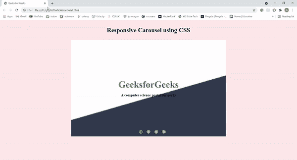

# 如何用 CSS 制作旋转木马？

> 原文:[https://www . geeksforgeeks . org/如何使用 css 制作旋转木马/](https://www.geeksforgeeks.org/how-to-make-a-carousel-using-css/)

在本文中，我们将学习如何在不使用任何其他库或框架的情况下使用普通 CSS 制作转盘。旋转木马是包含旋转横幅/图像集合的幻灯片显示。通常，你可以在网站的主页上看到旋转木马。它让你的网站更有吸引力。

我们将制作一个 4 图像转盘，可以通过转盘底部的按钮进行控制。旋转木马的中心有一个文本，它是固定的，不能随着图像的移动而移动。图像在背景中经过固定的时间间隔后移动。

我们正在使用 HTML 作为我们的旋转木马和 CSS 的基本结构来装饰它。下面是我们将要遵循的一步一步的程序。

**第一步:**首先，我们添加 HTML 代码。它包含主**容器**，在一个容器里面，有两样东西:

*   网页的主标题
*   是一个 div，类**内容**包含整个转盘结构。

**第二步:**现在，我们将在**内容**分区中添加以下两个部分:

*   第一部分是一个 div 类**转盘-内容。**内容(标题和副标题)放在转盘的中央。这将在转盘中保持静止。
*   第二部分是一个 div，有一个类**幻灯片。**转盘的所有移动部件都将在该分区内。

**步骤 3:****幻灯片显示**分区包含以下元素:

*   四个转盘控制按钮
*   一个幻灯片包装，包装所有 4 个旋转木马图像。

然后，我们添加 CSS 来设计我们的旋转木马，并使旋转木马对所有屏幕尺寸都有响应。

```css
NOTE: We will use "rem" and "%" units 
as much as possible to achieve responsiveness 
easily.
```

下面是上述方法的实现。

**示例:**

## index.html

```css
<!DOCTYPE html>
<html lang="en">
<head>
    <style>
        /* default stylings */
        * {
            box-sizing: border-box;
            margin: 0;
            padding: 0;
        }

        /* provides background color to body */
        body {
            background-color: rgb(255, 235, 235);
        }

        /* ----- container stylings: 
        -> centers the whole content of the page
        -> defines width and height for container ----- */
        .container {
            display: flex;
            flex-direction: column;
            justify-content: center;
            align-items: center;
            margin: auto;
            width: 800px;
            height: 600px;
        }
        /* ----- end of container stylings ----- */

        /* provides padding to main heading */
        .main-heading {
            padding: 2rem 0 2rem 0;
        }

        .content {
            position: relative;
        }

        /* ----- carousel content stylings ----- */
        /* places the carousel content on center of the carousel */
        .carousel-content {
            position: absolute;
            /*to center the content horizontally and vertically*/
            top: 50%;
            left: 50%;
            transform: translate(-50%, -50%); 
            text-align: center;
            z-index: 50;
        }
        .carousel-heading {
            font-size: 3rem;
            color: #308d46;
            margin-bottom: 1rem;
        }
        /*----- end of carousel content stylings ----- */

        /* ----- slideshow stylings ----- */
        .slideshow {
            height: 100%;
            overflow: hidden; /* to hide slides in x-direction */
            position: relative;
        }
        /* wrapper which wraps all the slideshow images stylings */
        .slideshow-wrapper {
            display: flex;
            /* We give it width as 400% because we are making a 
               4 image carousel. If you want to make for example, 
               5 images carousel, then give width as 500%. */
            width: 400%;
            height: 100%;
            position: relative;
            /* you can change the animation settings from below */
            animation: slideshow 20s infinite;
         }
        /* define width and height for images*/
        .slide {
            width: 100%;
            height: 100%;
        }
        .slide-img {
            width: 100%;
            height: 100%;
            object-fit: cover; 
        }
        /* @keyframes are used to provide animations
           We make these settings for 4 image carousel.
           Make modification accourding to your needs. */
        @keyframes slideshow {
            0%  { left: 0; }
            10% { left: 0; }
            15% { left: -100%; }
            25% { left: -100%; }
            30% { left: -200%; }
            40% { left: -200%; }
            45% { left: -300%; }
            55% { left: -300%; }
            60% { left: -200%; }
            70% { left: -200%; }
            75% { left: -100%; }
            85% { left: -100%; }
            90% { left: 0%; }
        }
        /* ----- end of slideshow stylings ----- */

        /* ----- carousel control buttons stylings ----- */
        .slide-btn {
            background-color: #bbb;
            border-radius: 50%;
            border: .2rem solid #d38800;
            width: 1.2rem;
            height: 1.2rem;
            outline: none;
            cursor: pointer;
            /* stylings for positioning the buttons at
               the bottom of the carousel */
            position: absolute;
            bottom: 3%;
            left: 50%;
            transform: translateX(-50%);
            z-index: 70;
        }
        /* As we provide position as absolute, 
        the buttons places one over the other. 
        So, we have to place them individually
        at their correct positions. */
        .slide-btn-1 {
            left: 45%;
        }
        .slide-btn-2 {
            left: 50%;
        }
        .slide-btn-3 {
            left: 55%;
        }
        .slide-btn-4 {
            left: 60%;
        }
        /* When we focus on the particular button, 
        the animation stops to that particular image 
        to which the button is associated. */
        .slide-btn-1:focus~.slideshow-wrapper {
            animation: none;
            left: 0;
        }
        .slide-btn-2:focus~.slideshow-wrapper {
            animation: none;
            left: -100%;
        }
        .slide-btn-3:focus~.slideshow-wrapper {
            animation: none;
            left: -200%;
        }
        .slide-btn-4:focus~.slideshow-wrapper {
            animation: none;
            left: -300%;
        }
        /* when we focus on the button, the background color changes */
        .slide-btn:focus {
            background-color: #308d46;
        }
        /* ----- end of carousel control buttons stylings ----- */
    </style>
    <title>Geeks For Geeks</title>
</head>
<body>
    <div class="container">
        <h1 class="main-heading">Responsive Carousel using CSS</h1>
        <div class="content">
            <!-- The content which is placed at the center of the carousel -->
            <div class="carousel-content">
                <h1 class="carousel-heading">
                    GeeksforGeeks
                </h1>
                <h3>A computer science portal for geeks</h3>
            </div>
            <div class="slideshow">
                <!-- carousel control buttons -->
                <button class="slide-btn slide-btn-1"></button>
                <button class="slide-btn slide-btn-2"></button>
                <button class="slide-btn slide-btn-3"></button>
                <button class="slide-btn slide-btn-4"></button>
                <!-- carousel wrapper which contains all images -->
                <div class="slideshow-wrapper">
                    <div class="slide">
                        
                    </div>
                    <div class="slide">
                        
                    </div>
                    <div class="slide">
                        
                    </div>
                    <div class="slide">
                        
                    </div>
                </div>
            </div>
        </div>
    </div>
</body>
</html>
```

**输出:** 从这里我们可以看到，对于所有屏幕尺寸，即移动、平板和笔记本电脑屏幕，旋转木马看起来都很漂亮。根据你的选择对上面的代码进行修改，将它包含在你的项目中，并享受构建令人敬畏的项目的乐趣。

