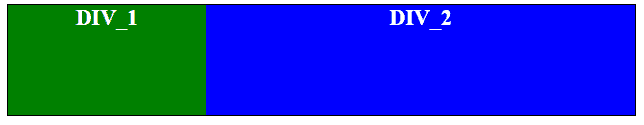
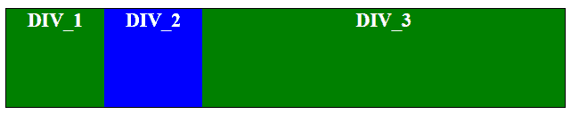

# 如何用 CSS 让一个 div 填充剩余的水平空间？

> 原文:[https://www . geeksforgeeks . org/how-make-a-div-fill-a-restricted-横置-space-use-CSS/](https://www.geeksforgeeks.org/how-to-make-a-div-fill-a-remaining-horizontal-space-using-css/)

width 属性用于使用 CSS 填充 div 剩余的水平空间。通过将宽度设置为 100%，它将采用其父级的整个可用宽度。

**语法:**

```css
width: 100%;
```

**示例 1:** 本示例使用 width 属性填充水平空间。它将宽度设置为 100%以完全填充它。

```css
<!DOCTYPE html> 
<html> 

<head> 
    <title> 
        make a div fill remaining 
        horizontal space 
    </title>

    <!-- Style to fill remaining 
        horizontal space -->
    <style>
        #main {
            height: 100px;
            border: 1px solid black;
            font-size: 20px;
            font-weight: bold;
            color: white;
        }
        #left {
            float: left;
            width: 180px;
            height: 100%;
            background-color: green;
        }
        #right {
            width: 100%;
            height: 100%;
            background-color: blue;
        }
    </style>
</head>     

<body style = "text-align:center;">         
    <div id = "main">
        <div id="left">
            DIV_1
        </div>

        <div id="right">
            DIV_2
        </div>
    </div> 
</body> 

</html>                    
```

**输出:**


**示例 2:** 本示例使用 width 属性填充水平空间。它将宽度设置为 100%以完全填充它。

```css
<!DOCTYPE html>  
<html>  

<head> 
    <title> 
        Title
    </title>

    <style>
        #main {
            height: 100px;
            border: 1px solid black;
            font-size: 20px;
            font-weight: bold;
            color: white;
        }
        #left {
            float: left;
            width: 100px;
            height: 100%;
            background-color: green;
        }
        #center {
            float: left;
            width: 100px;
            height: 100%;
            background-color: blue;
        }
        #right {
            width: 100%;
            height: 100%;
            background-color: green;
        }
    </style>
</head>      

<body style = "text-align:center;">          
    <div id = "main">
        <div id="left">
            DIV_1
        </div>

        <div id="center">
            DIV_2
        </div>

        <div id="right">
            DIV_3
        </div>
    </div>   
</body>  

</html>
```

**输出:**


HTML 是网页的基础，通过构建网站和网络应用程序用于网页开发。您可以通过以下 [HTML 教程](https://www.geeksforgeeks.org/html-tutorials/)和 [HTML 示例](https://www.geeksforgeeks.org/html-examples/)从头开始学习 HTML。

CSS 是网页的基础，通过设计网站和网络应用程序用于网页开发。你可以通过以下 [CSS 教程](https://www.geeksforgeeks.org/css-tutorials/)和 [CSS 示例](https://www.geeksforgeeks.org/css-examples/)从头开始学习 CSS。