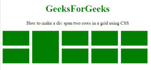

# 如何用 CSS 让 div 跨越网格中的两行？

> 原文:[https://www . geeksforgeeks . org/如何使用-css/](https://www.geeksforgeeks.org/how-to-make-a-div-span-two-rows-in-a-grid-using-css/) 制作网格中的两行

假设我们在一行中有 5 个元素，任务是在一行的中间放一个更大的元素。如何借助 CSS 让一个 DIV 跨越网格的 2 行？

**方法 1:** 首先获取 **ID(【外】)**的外 DIV 的高度。我们知道现在设计的外部元素的高度可以使用 **CSS Flexbox** 和 **[来实现，柔化方向:柱](https://www.geeksforgeeks.org/css-flex-direction-property/)** 和 **[柔化包裹:包裹](https://www.geeksforgeeks.org/css-flex-wrap-property/)。**容器上的固定高度告诉 flex 项目在哪里包装。

**示例:**

```html
<!DOCTYPE HTML>
<html>

<head>
    <style>
        #outer {
            display: flex;
            flex-direction: column;
            flex-wrap: wrap;
            height: 120px;
            width: 516px;
        }

        .div {
            width: 90px;
            flex: 0 0 50px;
            margin: 5px;
            background-color: green;
        }

        .big {
            flex-basis: 110px;
        }
    </style>
</head>

<body style="text-align:center;">
    <h1 style="color:green;">
        GeeksForGeeks
    </h1>

    <p id="GFG_UP">
        How to make a div span two 
        rows in a grid using CSS
    </p>

    <div id="outer">
        <div class="div"></div>
        <div class="div"></div>
        <div class="div big"></div>
        <div class="div"></div>
        <div class="div"></div>
        <div class="div"></div>
        <div class="div"></div>
        <div class="div"></div>
        <div class="div"></div>
    </div>
</body>

</html>
```

**输出:**



**方法 2:**

*   创建块级外部 DIV。
*   创建一个 90px 宽度的网格列，并做 5 次。
*   将自动创建行。
*   像这样的属性。**抓地间隙**是**栅格行间隙**和**栅格列间隙**的简写。
*   大项目将从第 1 行跨越到第 3 行
*   大项目将从网格列线 2 跨越到 3。

**示例:**

```html
<!DOCTYPE HTML>
<html>

<head>
    <style>
        #outer {
            display: grid;
            grid-template-columns: repeat(5, 90px);
            grid-auto-rows: 50px;
            grid-gap: 10px;
            width: 516px;
        }

        .big {
            grid-row: 1 / 3;
            grid-column: 2 / 3;
        }

        .div {
            background-color: green;
        }
    </style>
</head>

<body style="text-align:center;">
    <h1 style="color:green;">
        GeeksForGeeks
    </h1>
    <p id="GFG_UP">
        How to make a div span two rows
        in a grid using CSS
    </p>
    <div id="outer">
        <div class="div"></div>
        <div class="div"></div>
        <div class="div big"></div>
        <div class="div"></div>
        <div class="div"></div>
        <div class="div"></div>
        <div class="div"></div>
        <div class="div"></div>
        <div class="div"></div>
    </div>
</body>

</html>
```

**输出:**

