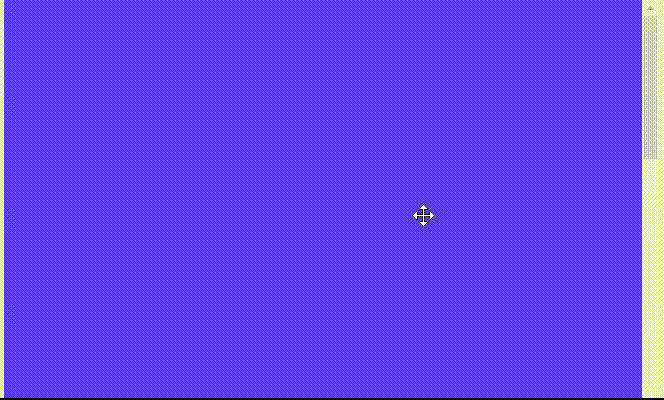

# 如何用 CSS 让一个 div 在没有内容的情况下可以垂直滚动？

> 原文:[https://www . geesforgeks . org/how-to-make-a-div-垂直滚动-无内容使用-css/](https://www.geeksforgeeks.org/how-to-make-a-div-vertically-scrollable-without-content-using-css/)

在本文中，我们将看到如何使用 CSS 创建一个垂直的可滚动部分。HTML 代码用于创建各部分的基本结构，CSS 代码用于设置样式，

**HTML 代码:**

*   用类*容器*创建一个 HTML [*div*](https://www.geeksforgeeks.org/div-tag-html/) 元素。
*   用类*框*创建了三个嵌套的 *div*
*   用类*框*在每个*分区*内写一些内容。

**CSS 代码:**

*   在这种情况下，添加了“滚动”选项，以始终显示 [*溢出-y*](https://www.geeksforgeeks.org/css-overflow-y-property/) 属性的滚动条。
*   视口 100%高度的高度设置为 100vh，设置的原因是如果内容超出，它会添加滚动条。
*   [*滚动捕捉类型*](https://www.geeksforgeeks.org/css-scroll-snap-type/) 设置为 *y* ，使得*容器* div 的滚动捕捉方向在 y 轴上。如果需要在特定时间停止浏览器，则会添加此属性。这将强制滚动到 y 轴上的捕捉点。
*   [*【滚动-对齐】*](https://www.geeksforgeeks.org/css-scroll-snap-align-property/) 属性用于具有类“框”的元素，以设置滚动将对齐的位置。*滚动对齐*用于指示滚动应该停止的点。

**示例:**

## 超文本标记语言

```html
<!DOCTYPE html>
<html>

<head>
    <style type="text/css">
        body {
            margin: 0;
        }

        /* Adding scroll snap type mandatory 
        and scoll direction to y axis*/
        .container {
            scroll-snap-type: y mandatory;
            overflow-y: scroll;

            /* 100% height of the viewport */
            height: 100vh;
        }

        /* Adding general css to box and 
        aligning snap to start */
        .box {
            height: 100vh;
            color: #fff;
            text-align: center;
            line-height: 100vh;
            font-size: 5rem;
            scroll-snap-align: start;
        }

        /* Setting different colors to all boxes */
        .box:nth-child(1) {
            background: #5e38ff;
        }

        .box:nth-child(2) {
            background: #fe802b;
        }

        .box:nth-child(3) {
            background: #00bf71;
        }
    </style>
</head>

<body>
    <div class="container">
        <div class="box"></div>
        <div class="box"></div>
        <div class="box"></div>
    </div>
</body>

</html>
```

**输出:**

