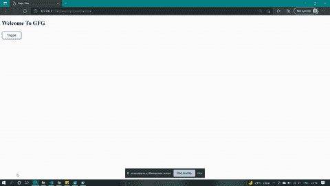

# 如何在不调用 CSS Grid 属性的情况下制作网格？

> 原文:[https://www . geeksforgeeks . org/如何不调用-css-grid-property/](https://www.geeksforgeeks.org/how-to-make-a-grid-without-calling-css-grid-property/)

在本文中，我们将看到如何在不调用 CSS Grid 属性的情况下制作网格，并通过示例了解其实现。理解 CSS grid 属性是如何工作的是很重要的，但是如果我们不使用 CSS grid 属性来制作一个网格呢？这是面试官问的一般性问题，可以让你更好地理解如何在不使用特定或专用方法或属性的情况下定制设计或其他设计方式。在这里，我们将首先创建一个 HTML 文件，其中包含一个用于网格的 div 容器，第二个我们创建了一个按钮，它是一个切换按钮。下面是基本结构的 HTML 代码。

**HTML 代码:**

## 超文本标记语言

```html
<!DOCTYPE html>
<html>

<head>
    <title>
        Grid structure without 
        using CSS Grid Property
    </title>
    <script src="practice.js"></script>
    <link rel="stylesheet" href="practice.css">
</head>

<body>
    <h2>Welcome To GFG</h2>
    <div id="grid"></div>
    <button id="togglebtn">
        Toggle
    </button>
</body>

</html>
```

**CSS 代码:**在 CSS 中，首先，我们用有助于设计网格结构的基本 CSS 属性来设计网格和按钮。我们将显示设置为 flex，它将设置灵活项目的灵活长度，以及定义其他 CSS 属性，即页边距-顶部、对齐-内容、宽度、高度等。为了创建 9*9 网格的图块，我们将创建 60*60px 的图块，然后给出左右边框。
下面的方法，我们做到了

```html
breadth of grid container = width of tile * 9 + border-width * 2
```

**注意:**在上式中，[边框宽度](https://www.geeksforgeeks.org/css-border-width-property/)属性定义了边框的宽度。

我们将根据上面的概念来创建网格容器的大小。确保每个元素都在图块的中心。为此，我们设置了边距，使其不会分离和凌乱。我们添加了带有框阴影属性的切换 btn，并为按钮添加了颜色，这样当悬停时，它会发光，还创建了一个隐藏类，通过将显示设置为无来隐藏按钮。

## 练习. css

```html
#grid {
  display: flex;
  margin-top: 10px;
  flex-wrap: wrap;
  border: 1px solid black;
  align-content: center;
  width: 566px;
  height: 566px;
  margin-bottom: 2vmin;
}
/*It is the tile which will append to the grid*/
.tile {
  display: flex;
  flex-wrap: wrap;
  justify-content: center;
  align-items: center;
  border: 1px solid black;
  width: 60px;
  height: 60px;
  text-align: center;
  margin: 0px;
  font-size: 5vmin;
}
/* Thick right border for segregation*/
.rightborder {
  border-right: 5px solid black;
}
.bottomborder {
  border-bottom: 5px solid black;
}
#togglebtn {
  height: 5vmin;
  width: 12vmin;
  background: none;
  border-radius: 1vmin;
}
#togglebtn:hover {
  background-color: cyan;
  box-shadow: 0 0 12px cyan;
  cursor: pointer;
}
.hide {
  display: none;
}
```

**JS 代码:**在 JavaScript 中，我们创建了一个 *id* 函数，返回将要传递的元素的 *id* 。在窗口加载中，我们将运行*进行*循环，&也将使用[*document . createElement()*方法](https://www.geeksforgeeks.org/html-dom-createelement-method/)创建元素，该方法将用于创建 HTML 元素。它会给我们在循环中创建的每个图块一个 *id* 而不是 *idcount* ，然后将计数器增加 1，以便为不同的值生成。现在，通过计算其宽度，在某些点添加右&左边框。添加 *if* 和 *else* 条件，该条件将添加一个切换按钮特征。如果点击的计数是偶数，那么我们从其中移除 CSS hide 类，如果计数是奇数，那么点击添加 hide 类。

## practice.js

```html
function id(id) {
    return document.getElementById(id);
}

let count = 0;
let idcount = 0;

window.onload = () => {
    for (let i = 0; i < 81; i++) {

        // Create tile & gave it CSS of the
        // tile and then append it
        let tile = document.createElement("p");
        tile.id = idcount;
        idcount++;
        tile.classList.add("tile");
        tile.textContent = "";

        // console.log(id("grid"));
        if ((tile.id > 17 && tile.id < 27) || 
        (tile.id > 44 && tile.id < 54)) {
            tile.classList.add("bottomborder");
        }

        // Add right border after certain number
        // of tiles, you can do anywhere you want,
        // remember to calculate its width
        if ((tile.id + 1) % 9 == 3 
        || (tile.id + 1) % 9 == 6) {
            tile.classList.add("rightborder");
        }

        // console.log();
        id("grid").appendChild(tile);
    }

    // Grid will be displayed if setting
    // the display to none
    id("togglebtn").addEventListener("click", () => {
        if (count % 2 == 0) {
            id("grid").style.display = "none";
            count++;
        } else {
            id("grid").style.display = "flex";
            count++;
        }
    });
};
```

**输出:**



不使用 CSS 网格属性显示网格