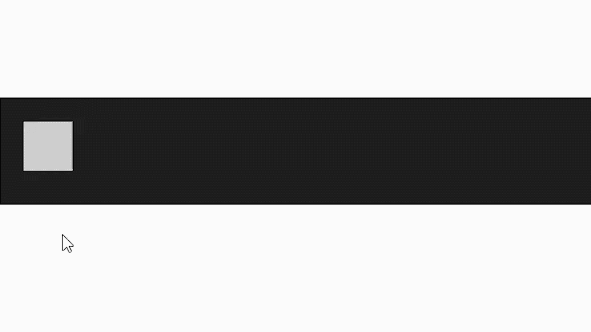
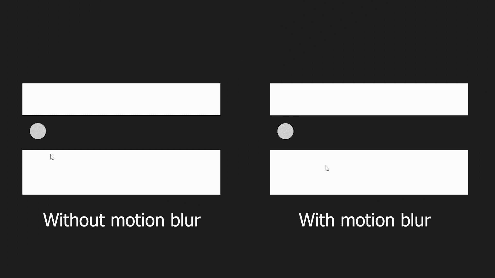

# 如何用 CSS 转场制作逼真的运动模糊？

> 原文:[https://www . geeksforgeeks . org/如何使用 css 制作逼真的运动模糊转场/](https://www.geeksforgeeks.org/how-to-make-a-realistic-motion-blur-with-css-transitions/)

在本文中，我们将使用 CSS 过渡创建一个逼真的运动模糊效果。运动模糊是一种特殊的效果，我们可以在各种在线视频、电影或动画剪辑中看到。当一个物体以相当快的速度从一个地方移动到另一个地方时，它会变得模糊，这使得用户推断该物体移动得很快。

我们将使用 CSS [*过渡*](https://www.geeksforgeeks.org/css-transition-property/) 属性创建相同的效果。CSS 转换:这个属性允许我们在页面上平滑地移动元素。我们将使用 CSS [*过渡-延迟*](https://www.geeksforgeeks.org/css-transition-delay-property/) 属性，该属性帮助我们以指定的延迟开始过渡。

**方法:**我们将创建 15 次相同的形状，并对每个元素使用略有不同的过渡延迟，以将元素从一个位置移动到另一个位置。这个简单的方法将帮助我们创建一个真实的运动模糊的元素。

**示例 1:** 我们将使用一个矩形形状作为我们的运动模糊效果，当光标移动到容器时，该形状将随着运动模糊效果开始移动。

## 超文本标记语言

```css
<!DOCTYPE html>
<html lang="en">

<head>
    <style>
        .object_container {
            width: 100%;
            height: 100px;
            position: relative;
            margin: 100px auto;
            text-align: center;
            font-family: sans-serif;
            padding-top: 10px;
            background-color: rgb(32, 32, 32);
        }

        .shape {
            position: absolute;
            background: rgb(255, 255, 255);
            width: 50px;
            height: 50px;
            border-radius: 0%;
            transform: rotate(0deg);
            top: 25px;
            left: 25px;
            opacity: 0.1;
            transition: all 0.75s 
                cubic-bezier(0.23, 1, 0.32, 1) 0ms;
        }

        .object_container:hover .shape {
            left: 525px;
        }

        .shape.two {
            transition-delay: 2ms;
        }

        .shape.three {
            transition-delay: 4ms;
        }

        .shape.four {
            transition-delay: 6ms;
        }

        .shape.five {
            transition-delay: 8ms;
        }

        .shape.six {
            transition-delay: 10ms;
        }

        .shape.seven {
            transition-delay: 12ms;
        }

        .shape.eight {
            transition-delay: 14ms;
        }

        .shape.nine {
            transition-delay: 16ms;
        }

        .shape.ten {
            transition-delay: 18ms;
        }

        .shape.eleven {
            transition-delay: 20ms;
        }

        .shape.twelve {
            transition-delay: 22ms;
        }

        .shape.thirteen {
            transition-delay: 24ms;
        }

        .shape.fourteen {
            transition-delay: 26ms;
        }

        .shape.fifteen {
            transition-delay: 28ms;
        }
    </style>
</head>

<body>
    <div class="object_container">
        <div class="shape one"><br /></div>
        <div class="shape two"><br /></div>
        <div class="shape three"><br /></div>
        <div class="shape four"><br /></div>
        <div class="shape five"><br /></div>
        <div class="shape six"><br /></div>
        <div class="shape seven"><br /></div>
        <div class="shape eight"><br /></div>
        <div class="shape nine"><br /></div>
        <div class="shape ten"><br /></div>
        <div class="shape eleven"><br /></div>
        <div class="shape twelve"><br /></div>
        <div class="shape thirteen"><br /></div>
        <div class="shape fourteen"><br /></div>
        <div class="shape fifteen"><br /></div>
    </div>
</body>

</html>
```

**输出:**



带有 CSS 过渡的运动模糊

**示例 2:** 在这个示例中，我们可以清楚地看到有和没有运动模糊的区别，我们将对圆形应用相同的效果。

## 超文本标记语言

```css
<!DOCTYPE html>
<html lang="en">

<head>
    <style>
        body {
            background-color: rgb(41, 41, 41);
        }

        /* First container is moving 
        without motion blur */
        .object_container1 {
            width: 615px;
            height: 100px;
            position: absolute;
            margin: 100px auto;
            text-align: center;
            font-family: sans-serif;
            padding-top: 10px;
            background-color: rgb(32, 32, 32);
        }

        /* Second container is moving 
        with motion blur */
        .object_container2 {
            width: 615px;
            height: 100px;
            position: absolute;
            margin: 100px auto;
            text-align: center;
            font-family: sans-serif;
            padding-top: 10px;
            background-color: rgb(32, 32, 32);
        }

        /* For this shape we have removed 
        the transition effect */
        .shape1 {
            position: absolute;
            background: rgb(255, 255, 255);
            width: 50px;
            height: 50px;
            border-radius: 0%;
            transform: rotate(0deg);
            top: 25px;
            left: 25px;
            opacity: 0.1;
            border-radius: 100%;
        }

        /* We have added the transition effect 
        so we can see the motion blur effect */
        .shape2 {
            position: absolute;
            background: rgb(255, 255, 255);
            width: 50px;
            height: 50px;
            border-radius: 0%;
            transform: rotate(0deg);
            top: 25px;
            left: 25px;
            opacity: 0.1;
            transition: all 0.75s 
                cubic-bezier(0.23, 1, 0.32, 1) 0ms;
            border-radius: 100%;
        }

        .box1 .box2 {
            display: flex;
            flex-direction: column;
            align-items: center;
            justify-content: center;
        }

        .box1 {
            top: 100px;
            left: 100px;
            position: absolute;
            height: 350px;
            width: 32%;
            background-color: #fff;
        }

        .box2 {
            top: 100px;
            right: 100px;
            position: absolute;
            height: 350px;
            width: 32%;
            background-color: #fff;
        }

        #without {
            position: absolute;
            top: 370px;
            left: 200px;
            color: #fff;
        }

        #with {
            position: absolute;
            top: 370px;
            right: 200px;
            color: #fff;
        }

        .object_container1:hover .shape1 {
            left: 525px;
        }

        .object_container2:hover .shape2 {
            left: 525px;
        }

        .shape2.two {
            transition-delay: 2ms;
        }

        .shape2.three {
            transition-delay: 4ms;
        }

        .shape2.four {
            transition-delay: 6ms;
        }

        .shape2.five {
            transition-delay: 8ms;
        }

        .shape2.six {
            transition-delay: 10ms;
        }

        .shape2.seven {
            transition-delay: 12ms;
        }

        .shape2.eight {
            transition-delay: 14ms;
        }

        .shape2.nine {
            transition-delay: 16ms;
        }

        .shape2.ten {
            transition-delay: 18ms;
        }
    </style>
</head>

<body>

    <!-- With motion blur -->
    <div class="box1">
        <div class="object_container1">
            <div class="shape1 one"><br /></div>
            <div class="shape1 two"><br /></div>
            <div class="shape1 three"><br /></div>
            <div class="shape1 four"><br /></div>
            <div class="shape1 five"><br /></div>
            <div class="shape1 six"><br /></div>
            <div class="shape1 seven"><br /></div>
            <div class="shape1 eight"><br /></div>
            <div class="shape1 nine"><br /></div>
            <div class="shape1 ten"><br /></div>
        </div>
        <h1 id="without">Without Motion blur</h1>
    </div>

    <!-- Without motion blur -->
    <div class="box2">
        <div class="object_container2">
            <div class="shape2 one"><br /></div>
            <div class="shape2 two"><br /></div>
            <div class="shape2 three"><br /></div>
            <div class="shape2 four"><br /></div>
            <div class="shape2 five"><br /></div>
            <div class="shape2 six"><br /></div>
            <div class="shape2 seven"><br /></div>
            <div class="shape2 eight"><br /></div>
            <div class="shape2 nine"><br /></div>
            <div class="shape2 ten"><br /></div>
        </div>

        <h1 id="with">With Motion blur</h1>
    </div>
</body>

</html>
```

**输出:**



使用 CSS 过渡的运动模糊