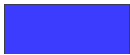

# 如何制作 CSS 动画？

> 原文:[https://www.geeksforgeeks.org/how-to-make-css-animations/](https://www.geeksforgeeks.org/how-to-make-css-animations/)

动画是一种通过以典型的格式一个接一个地放置静止图像来创建运动错觉的方法。例如，我们可以有一个球在某个瞬间上升，而不是下降作为动画效果。CSS 提供了一些属性来控制动画效果，通过改变它的一些变量，如定时和关键帧等。

一些 CSS 属性如下:

*   **[动画-名称](https://www.geeksforgeeks.org/css-animation-name-property/) :** 指定要使用的动画名称。
*   **[动画-迭代-计数](https://www.geeksforgeeks.org/css-animation-iteration-count-property/) :** 表示动画应该生效的周期数。
*   **[动画-方向](https://www.geeksforgeeks.org/css-animation-direction-property/) :** 指定动画播放的方向。
*   **[动画-延迟](https://www.geeksforgeeks.org/css-animation-delay-property/) :** 动画应该开始的时间段。
*   **[动画-时长](https://www.geeksforgeeks.org/css-animation-duration-property/) :** 提到动画持续的时长。

除了这些方法之外，还有其他一些方法，如:*动画-定时-功能、@关键帧、动画-填充-模式*等。

**解释:**基本上在我们的 CSS 代码中，首先我们必须使用*“@关键帧”*属性来指定动画应该显示的主要效果。然后在这个块中，我们必须写动画的效果，即大小的变化，从哪种颜色到哪种颜色的变化必须发生，不透明度的变化，等等。这些都可以用总时隙的百分比或使用“从”和“到”关键词来提及。因此，该块包含要显示的主动画代码。

以下是创建动画的示例。第一个动画导致不透明度的变化，第二个动画导致背景颜色的变化。

*   **例 1:**

    ## 半铸钢ˌ钢性铸铁(Cast Semi-Steel)

    ```html
    @keyframes animation_example1{
      /* animation results in change of opacity*/
      from{opacity:0.3;}
      to{opacity:1;}
    }
    ```

*   **示例 2:** 在这段代码中，我们创建了动画，但是为了将这些动画的效果链接到 HTML 标签(可能是 img 或其他标签)，我们必须在该标签的 CSS 样式中指定它们的名称。

    ## 半铸钢ˌ钢性铸铁(Cast Semi-Steel)

    ```html
    @keyframes animation_example2{
      /* here the amount of total time is divided */
      0%{height:220px;
        width:220px;
        opacity:0.7;}
      50%{height:240px;
        width:240px;
        opacity:0.4;}
    }
    ```

*   **示例 3:** 在这段代码中，我们可以提到动画的细节，比如定时和延迟周期，以及迭代次数等

    ## 半铸钢ˌ钢性铸铁(Cast Semi-Steel)

    ```html
    #pic1{
    animation-name:animation_example2;
      animation-duration:2s;
      animation-delay:0.5s;
      animation-iteration-count:infinite;
    }/* This animation will continue 
        infinite number of times */
    ```

下面是完整的 HTML 代码，上面提到的 CSS 将用于生成结果。

## 超文本标记语言

```html
<html>

<head>
  <style>
      @keyframes animation_example2{

        /* here the amount of total time is divided */
        0%{
          opacity:1;}
        50%{
          opacity:0.1;}
      }

      /* This animation will continue 
         infinite number of times */
      #gfg{
        animation-name: animation_example2;
        animation-duration:2s;
        animation-delay:0.5s;
        animation-iteration-count: infinite;
      }
  </style>
</head>

<body>
  <div id="gfg" 
      style="width:250px;height:100px;
      border:1px solid #000;
      background-color:blue">
  </div>
</body>

</html>
```

**输出:**



输出