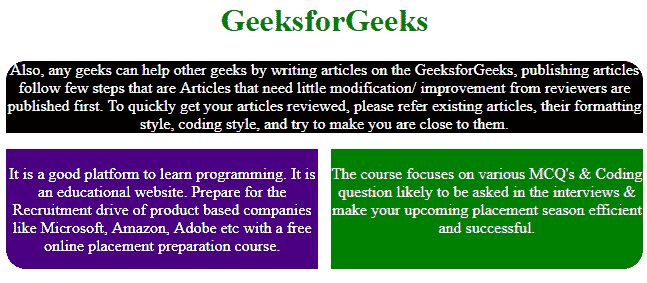

# 如何用 CSS 让 div 高度随其内容展开？

> 原文:[https://www . geesforgeks . org/how-to-make-div-height-expand-with-it-content-use-CSS/](https://www.geeksforgeeks.org/how-to-make-div-height-expand-with-its-content-using-css/)

height 属性用于设置元素的高度。height 属性不包含元素的填充、边距和边框。height 属性包含许多定义元素高度的值。高度属性值如下所示:

**语法:**

```css
height: length|percentage|auto|initial|inherit;
```

**属性值:**

*   **高度:自动；**用于将高度属性设置为默认值。如果高度属性设置为自动，浏览器将计算元素的高度。
*   **高:长；**用于以 px、cm 等形式设置元素的高度。长度不能为负。
*   **高度:初始；**用于将高度属性设置为默认值。
*   **身高:遗传；**用于从其父元素设置高度属性。

**例 1:** 本例使用高度:auto 属性来显示内容。

```css
<!DOCTYPE html>
<html>

<head>

    <!-- style to set height property to
            display content -->
    <style>
        p {
            color:white;
        }
        .main {
            background-color:black;
            height:auto;
            border-radius: 20px 20px 0px 0px;
        }
        .left-column {
            background-color:indigo;
            height:120px;
            width:49%;
            float:left;
            border-bottom-left-radius: 20px;
        }
        .right-column{
            background-color:green;
            height:7.5em;
            width:49%;
            float:right;
            border-bottom-right-radius: 20px;
        }
        h1{
            color:Green;
        }
    </style>
</head>

<body>
    <center>

    <h1>GeeksforGeeks</h1>

    <div class="main">
        <p>
            Also, any geeks can help other geeks by writing
            articles on the GeeksforGeeks, publishing articles
            follow few steps that are Articles that need
            little modification/improvement from reviewers
            are published first. To quickly get your articles
            reviewed, please refer existing articles, their
            formatting style, coding style, and try to make
            you are close to them. 
        </p>
    </div>

    <div class="left-column">
        <p> 
            It is a good platform to learn programming. It
            is an educational website. Prepare for the
            Recruitment drive of product based companies
            like Microsoft, Amazon, Adobe etc with a free
            online placement preparation course.
        </p>
    </div>

    <div class="right-column">
        <p>
            The course focuses on various MCQ's & Coding 
            question likely to be asked in the interviews
            & make your upcoming placement season efficient
            and successful.
        </p>
    </div>
    </center>
</body>

</html>                    
```

**输出**


**示例 2:** 蒂耶示例使用 height: inherit 属性显示内容。

```css
<!DOCTYPE html>
<html>

<head>

    <!-- CSS style to set height property of content -->
    <style>
        .auto {
            height:auto;
            background-color:orange;
        }
        .inherit {
            height:inherit;
            background-color:cyan;
        }
        .percentage {
            height:25%;
        }
        h1 {
            color:green;
        }
    </style>
</head>

<body style = "text-align:center;">

    <h1>GeeksforGeeks</h1>

    <div class="auto">
        <p>
            Also, any geeks can help other geeks by writing
            articles on the GeeksforGeeks, publishing articles
            follow few steps that are Articles that need
            little modification/improvement from reviewers
            are published first. To quickly get your articles
            reviewed, please refer existing articles, their
            formatting style, coding style, and try to make
            you are close to them. 
        </p>

        <div class="inherit">
            <p> 
                It is a good platform to learn programming. It
                is an educational website. Prepare for the
                Recruitment drive of product based companies
                like Microsoft, Amazon, Adobe etc with a free
                online placement preparation course.
            </p>
        </div>

        <div class="percentage">
            <p>
                The course focuses on various MCQ's & Coding 
                question likely to be asked in the interviews
                & make your upcoming placement season efficient
                and successful.
            </p>
        </div>
    </div> 
</body>

</html>                    
```

**输出:**
