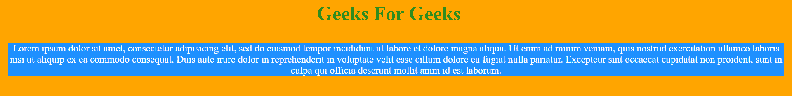
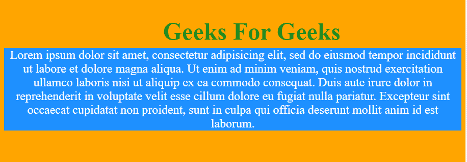
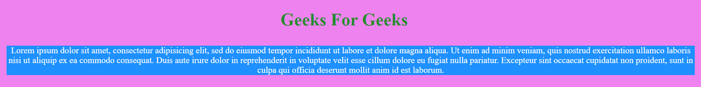
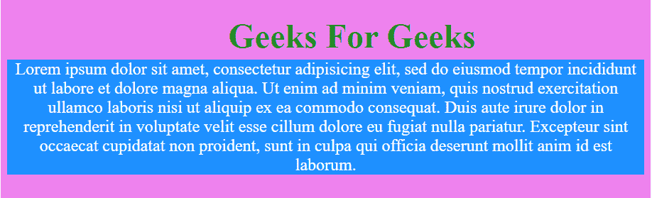
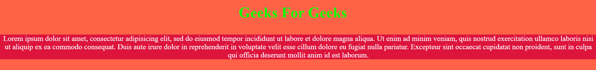
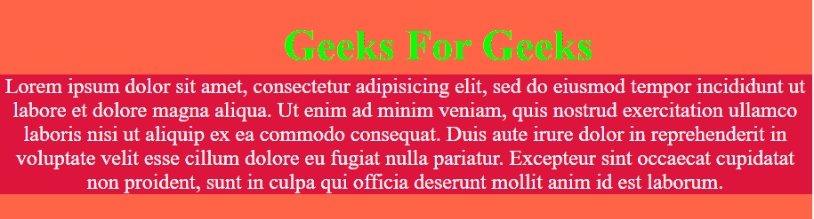

# 如何用 CSS 使 div 不大于其内容？

> 原文:[https://www . geeksforgeeks . org/如何使用-css/](https://www.geeksforgeeks.org/how-to-make-div-not-larger-than-its-contents-using-css/) 制作-div-不大于其内容

有三种方法可以解决这个问题:

1.  [默认情况下](#no_1)
2.  [使用内嵌块属性](#no_2)
3.  [在宽度和高度上使用适合度属性](#no_3)

## 默认案例:

默认情况下，在 HTML 中，div 适合于其中的内容。示例如下:
**示例 1:**

```html
<!DOCTYPE html>
<html lang = "en" dir = "ltr">
  <head>
    <meta charset = "utf-8">
    <title>Geeks for Geeks Example</title>
    <!--CSS Code-->
    <style media = "screen">
      body {
        background: orange;
        overflow: hidden;
        color: white;
      }
      .GeeksForGeeks {
        background: dodgerblue;
        position: absolute;
        top: 50%;
        left: 1%;
        right: 1%;
      }
    </style>
  </head>

  <body>
    <!-- HTML Code -->
    <center><h1 style = "color:forestgreen ; top:35% ; left: 35% ; 
    position:absolute; ">Geeks For Geeks</h1></center>
    <center>
      <div class = "GeeksForGeeks">
        Lorem ipsum dolor sit amet, consectetur adipisicing elit, sed do eiusmod
        tempor incididunt ut labore et dolore magna aliqua. Ut enim ad minim
        veniam, quis nostrud exercitation ullamco laboris nisi ut aliquip ex ea
        commodo consequat. Duis aute irure dolor in reprehenderit in voluptate
        velit esse cillum dolore eu fugiat nulla pariatur. Excepteur sint
        occaecat cupidatat non proident, sunt in culpa qui officia deserunt
        mollit anim id est laborum.
      </div>
    </center>
  </body>
</html>
```

**输出:**
显示了两种不同屏幕宽度的输出，这证明它与其中的内容相吻合。
**画面 1:**


**画面 2:**


## 使用内联块属性:

使用 display: inline-block 属性根据内容设置 div 大小。
**例 2:**

```html
<!DOCTYPE html>
<html lang = "en" dir = "ltr">
  <head>
    <meta charset = "utf-8">
    <title>Geeks for Geeks Example</title>
    <!--CSS Code-->
    <style media = "screen">
      body {
        background: violet;
        overflow: auto;
        color: white;
      }
      .GeeksForGeeks {
        background: dodgerblue;
        position: absolute;
        display: inline-block;
        left: 1%;
        right: 1%;
        top: 50%;
      }
    </style>
  </head>

  <body>
    <!-- HTML Code -->
    <center><h1 style="color: forestgreen; top: 35%; left: 35%;
      position: absolute;">Geeks For Geeks</h1></center>
    <center>
      <div class="GeeksForGeeks">
        Lorem ipsum dolor sit amet, consectetur adipisicing elit, sed do eiusmod
        tempor incididunt ut labore et dolore magna aliqua. Ut enim ad minim
        veniam, quis nostrud exercitation ullamco laboris nisi ut aliquip ex ea
        commodo consequat. Duis aute irure dolor in reprehenderit in voluptate
        velit esse cillum dolore eu fugiat nulla pariatur. Excepteur sint
        occaecat cupidatat non proident, sunt in culpa qui officia deserunt
        mollit anim id est laborum.
      </div>
    </center>
  </body>
</html>
```

**输出:**
显示了两种不同屏幕宽度的输出，这证明它与其中的内容相吻合。
**画面 1:**


**画面 2:**


## 在宽度和高度中使用适合内容属性:

在此方法中，我们将宽度和高度属性设置为适合内容值。
**例 3:**

```html
<!DOCTYPE html>
<html lang = "en" dir = "ltr">
  <head>
    <meta charset = "utf-8">
    <title>Geeks for Geeks Example</title>
    <!--CSS Code-->
    <style media = "screen">
      body {
        background: tomato;
        overflow: hidden;
        color: white;
      }
      .GeeksForGeeks {
        background: crimson;
        position: absolute;
        width:fit-content;
        height:fit-content;
        left: 0;
        top: 50%;
      }
    </style>
  </head>

  <body>
    <!-- HTML Code -->
    <center><h1 style = "color: lime; top: 35%; left: 35%;
      position: absolute;">Geeks For Geeks</h1></center>
    <center>
      <div class = "GeeksForGeeks">
        Lorem ipsum dolor sit amet, consectetur adipisicing elit, sed do eiusmod
        tempor incididunt ut labore et dolore magna aliqua. Ut enim ad minim
        veniam, quis nostrud exercitation ullamco laboris nisi ut aliquip ex ea
        commodo consequat. Duis aute irure dolor in reprehenderit in voluptate
        velit esse cillum dolore eu fugiat nulla pariatur. Excepteur sint
        occaecat cupidatat non proident, sunt in culpa qui officia deserunt
        mollit anim id est laborum.
      </div>
    </center>
  </body>
</html>
```

**输出:**
显示了两种不同屏幕宽度的输出，这证明它与其中的内容相吻合。
**画面 1:**


**画面 2:**
