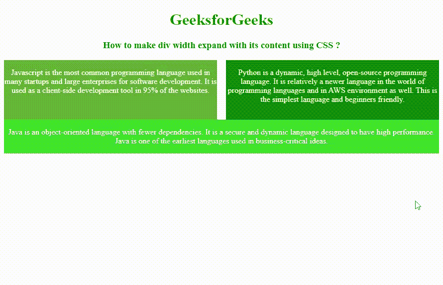

# 如何用 CSS 让 div 宽度随其内容扩展？

> 原文:[https://www . geeksforgeeks . org/how-make-div-width-expand-with-it-content-use-CSS/](https://www.geeksforgeeks.org/how-to-make-div-width-expand-with-its-content-using-css/)

给定一个 HTML 文档，任务是使用 CSS 使 div 宽度随其内容扩展。为此，width 属性用于设置元素的宽度，不包括元素的填充、边距和边框。宽度属性值如下所示:

**语法:**

```css
width: length|percentage|auto|initial|inherit;

```

**属性值:**

*   **宽度:自动；**用于将宽度属性设置为默认值。如果宽度属性设置为自动，浏览器将计算元素的宽度。
*   **宽:长；**用于以 px、cm 等形式设置元素宽度。长度不能为负。
*   **宽度:初始；**用于将宽度属性设置为默认值。
*   **宽度:继承；**用于从其父元素设置宽度属性。

**例 1:** 本例使用宽度:auto 属性来显示内容。

## 超文本标记语言

```css
<!DOCTYPE html>
<html>

<head>
    <title>
        How to make div width expand 
        with its content using CSS ?
    </title>

    <style>
        .geek2 {
            background-color: #6ba832;
            height: 120px;
            width: 49%;
            float: left;
            color: white;
        }

        .geek3 {
            background-color: green;
            height: 7.5em;
            width: 49%;
            float: right;
            color: white;
        }

        h1 {
            color: Green;
        }

        .geek1 {
            background-color: #35cc27;
            width: auto;
            color: white;
            float: right;
        }
    </style>
</head>

<body>
    <center>
        <h1>GeeksforGeeks</h1>

        <h3>
            How to make div width expand 
            with its content using CSS ?
        </h3>

        <div class="geek2">
            <p>
                Javascript is the most common 
                programming language used in 
                many startups and large enterprises 
                for software development. It is 
                used as a client-side development 
                tool in 95% of the websites. 
            </p>
        </div>

        <div class="geek3">
            <p>Python is a dynamic, high level, 
                open-source programming language. 
                It is relatively a newer language
                in the world of programming 
                languages and in AWS environment 
                as well. This is the simplest 
                language and beginners friendly. 
            </p>
        </div>

        <div class="geek1">
            <p>Java is an object-oriented language 
                with fewer dependencies. It is a 
                secure and dynamic language 
                designed to have high performance.
                Java is one of the earliest languages
                used in business-critical ideas. 
            </p>
        </div>
    </center>
</body>

</html>
```

**输出:**


**改变屏幕尺寸后输出:**


**示例 2:** 本示例使用 width: inherit 属性显示内容。

## 超文本标记语言

```css
<!DOCTYPE html>
<html>

<head>
    <title>
        How to make div width expand 
        with its content using CSS ?
    </title>

    <style>
        .geek2 {
            width: auto;
            background-color: green;
            width: 75%;
        }

        .geek3 {
            width: inherit;
            background-color: #28cc23;
            color: white;
        }

        .geek1 {
            width: 25%;
        }

        h1 {
            color: green;
        }
    </style>
</head>

<body>
    <center>

        <h1>GeeksforGeeks</h1>

        <h3>
            How to make div width expand 
            with its content using CSS ?
        </h3>

        <div class="geek2">
            <p>
                Javascript is the most common 
                programming language used in 
                many startups and large 
                enterprises for software 
                development.
            </p>

            <div class="geek3">
                <p>
                    Python is a dynamic, high 
                    level, open-source programming
                    language. It is relatively a 
                    newer language in the world
                    of programming languages and 
                    in AWS environment as well.
                </p>
            </div>

            <div class="geek1">
                <p>
                    Java is an object-oriented 
                    language with fewer dependencies. 
                    It is a secure and dynamic
                    language designed to have high 
                    performance.
                </p>
            </div>
        </div>
    </center>
</body>

</html>
```

**输出:**


**改变屏幕尺寸后输出:**
