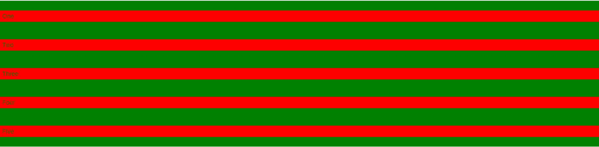

# 如何用 CSS 让 flexbox 孩子达到父母 100%身高？

> 原文:[https://www . geeksforgeeks . org/如何制作 flex box-儿童-100 高的父母-使用-css/](https://www.geeksforgeeks.org/how-to-make-flexbox-children-100-height-of-their-parent-using-css/)

CSS [Flexbox](https://www.geeksforgeeks.org/advance-css-layout-with-flexbox/) 是一个很棒的创建网站布局的工具。制作一个 100%高度的儿童伸缩箱有两种方法。这有点棘手，因为它肯定会显示一个错误。
例如，子对象可能会流出父对象的边界，或者可能不会达到您将在浏览器输出中看到的 100%高度。
**示例 1:** 本示例使用 CSS 制作了一个高度为 100%的儿童伸缩箱。

## 超文本标记语言

```html
<!DOCTYPE html>
<html>
   <head>
      <title>
          Make flex-box child height 100%
      </title>

      <style>
         * {
             padding: 0;
             margin: 0;
         }
         .container {
             width: 100vw;
             height: 50vh;
             background-color: green;
             display: flex;
             justify-content: center;
             align-items: center;
         }
         .child-div {
             height: 100%;
             background-color: red;
             margin: 0 20px;
         }
      </style>
   </head>

   <body>
      <div class="container">
         <div class="child-div">
            One
         </div>
         <div class="child-div">
            Two
         </div>
         <div class="child-div">
            Three
         </div>
         <div class="child-div">
            Four
         </div>
         <div class="child-div">
            Five
         </div>
      </div>
   </body>
</html>
```

**输出:**


**示例 2:** 第二种方法是使用父 div 中的 align-items 属性来“拉伸”。它让每一个。子分区 100%的高度是父分区的高度。

## 超文本标记语言

```html
<!DOCTYPE html>
<html>
   <head>
      <title>
          Make flex-box child height 100%
      </title>

      <style>
         *{
             padding: 0;
             margin: 0;
         }
         .container{
             width: 100vw;
             height: 50vh;
             background-color: green;
             display: flex;
             justify-content: center;
         }
         .child-div{
             background-color: red;
             margin: 0 20px;
         }
      </style>
   </head>

   <body>
      <div class="container">
         <div class="child-div">
            One
         </div>
         <div class="child-div">
            Two
         </div>
         <div class="child-div">
            Three
         </div>
         <div class="child-div">
            Four
         </div>
         <div class="child-div">
            Five
         </div>
      </div>
   </body>
</html>
```

**输出:**


**示例 3:** 本示例将子对象的宽度设为父对象的 100%。

## 超文本标记语言

```html
<!DOCTYPE html>
<html>
   <head>
      <title>
          Make flex-box child width 100%
      </title>

      <style>
         * {
             padding: 0;
             margin: 0;
         }
         .container {
             width: 100vw;
             height: 50vh;
             background-color: green;
             display: flex;
             flex-direction: column;
             justify-content: center;
         }
         .child-div {
             background-color: red;
             margin: 20px 0;
             padding: 5px;
         }
      </style>
   </head>

   <body>
      <div class="container">
         <div class="child-div">
            One
         </div>
         <div class="child-div">
            Two
         </div>
         <div class="child-div">
            Three
         </div>
         <div class="child-div">
            Four
         </div>
         <div class="child-div">
            Five
         </div>
      </div>
   </body>
</html>
```

**输出:**



**支持的浏览器:**

*   谷歌 Chrome 29.0
*   Internet Explorer 11.0
*   Firefox 22.0
*   歌剧 48
*   Safari 10

HTML 是网页的基础，通过构建网站和网络应用程序用于网页开发。您可以通过以下 [HTML 教程](https://www.geeksforgeeks.org/html-tutorials/)和 [HTML 示例](https://www.geeksforgeeks.org/html-examples/)从头开始学习 HTML。

CSS 是网页的基础，通过设计网站和网络应用程序用于网页开发。你可以通过以下 [CSS 教程](https://www.geeksforgeeks.org/css-tutorials/)和 [CSS 示例](https://www.geeksforgeeks.org/css-examples/)从头开始学习 CSS。