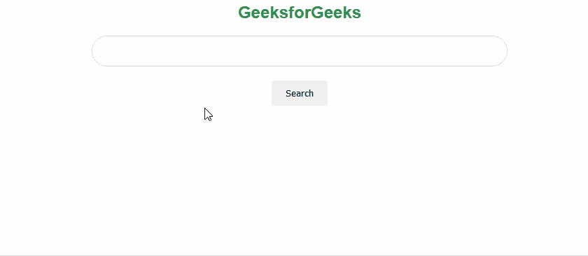

# 如何用 CSS 让谷歌搜索栏像输入框一样在悬停时高亮显示？

> 原文:[https://www . geesforgeks . org/how-make-Google-search-bar-like-input-box-highlight-on-hover-use-CSS/](https://www.geeksforgeeks.org/how-to-make-google-search-bar-like-input-box-highlight-on-hover-using-css/)

在本文中，我们将学习如何像谷歌搜索栏一样在悬停时突出显示输入框。

**方法:**我们将使用 CSS *悬停*属性，这样无论何时我们悬停在一个元素上，我们都可以有一些动画。对于输入框，有一个*框阴影*属性，我们可以用它来指定我们的阴影尺寸。

**示例:**

## 超文本标记语言

```css
<!DOCTYPE html>
<html>

<head>
    <style>
        h2 {

            /* Styling for the geeksforgeeks
            text on the page which is green
            in color, centered and has the
            font family of Arial */
            color: #2f8d46;
            text-align: center;
            font-family: "Arial";
        }

        #search-bar {

            /* Set the display as block which will 
            take whole width of the page */
            display: block;

            /* Set the margin-left and margin-right
            to 'auto' so that search bar will be at
           the center */
            margin-left: auto;
            margin-right: auto;

            /* Set the search bar to have the width
            to '550px' and height to '40px' similar 
            to Google Search Bar */
            width: 550px;

            /* Set the border-radius to '50px' which 
            makes the corners of search bar as round */
            border-radius: 50px;
            height: 40px;

            /* Set the border to a solid color */
            border: 1px solid #dddddd;

            /* Disable the outline */
            outline: none;

            /* Set the padding-left to '40px' that 
            will make the cursor to start the 40px 
            from the left  */
            padding-left: 40px;
        }

        input:hover {

            /* Styling for search bar when we hover on
              it to show the shadow of the search bar
            The attributes for box-shadow are:
            offset-x | offset-y | blur-radius | color */
            box-shadow: 0px 1px 3px rgb(192, 185, 185);

            /* You can play with these values to
            get your desired shadow effect */
        }

        .buttons {

            /* Styling the buttons of the page*/
            padding: 10px 20px 10px 20px;
            border-radius: 4px;
            border: none;
            margin-top: 20px;
            cursor: pointer;
        }

        .container {

            /* Center the button on the page */
            text-align: center;
        }
    </style>
</head>

<body>
    <div class="container">
        <h2>GeeksforGeeks</h2>
        <input id="search-bar" type="text" />
        <button class="buttons">Search</button>
    </div>
</body>

</html>
```

**输出:**

