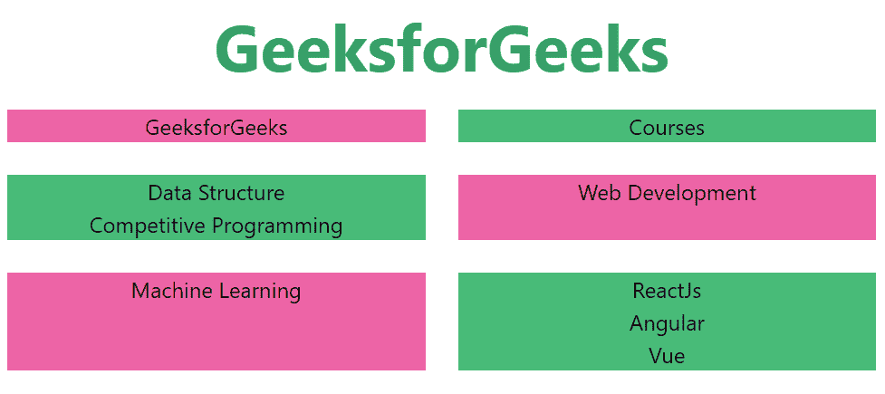
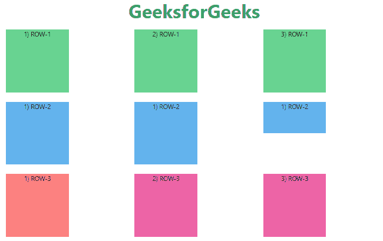

# 如何用顺风 CSS 让网格项目自动高度？

> 原文:[https://www . geesforgeks . org/如何制作网格-物品-自动-高度-使用-顺风-css/](https://www.geeksforgeeks.org/how-to-make-grid-items-auto-height-using-tailwind-css/)

您可以使用顺风 CSS 中的[网格-模板-列属性轻松地将 CSS 网格项目设置为自动高度。](https://www.geeksforgeeks.org/css-grid-template-columns-property/)

顺风使用*网格列*和*网格行*属性，这是 CSS 中[网格模板列属性的替代。](https://www.geeksforgeeks.org/css-grid-template-columns-property/)CSS 中的*网格-模板-列*属性用于设置网格的列数和列的大小。

这个类在 tailwind CSS 中接受多个值，所有的属性都以类的形式被覆盖。列的数量由给这个类的值的数量来设置。

**网格模板列:**

*   **网格-列-1:** 每行只包含一列。
*   **网格-列-6:** 每行包含六列。
*   **网格-列-12:** 每行包含 12 列。

**语法:**

```
<element class="grid grid-cols-number"> Contents... </element>
```

**例 1:**

## 超文本标记语言

```
<!DOCTYPE html>
<html>

<head>
    <link href=
"https://unpkg.com/tailwindcss@^1.0/dist/tailwind.min.css"
        rel="stylesheet" />
</head>

<body class="text-center">
    <h1 class="text-green-600 text-5xl font-bold">
        GeeksforGeeks
    </h1>

    <div class="grid grid-cols-2">
        <div class="bg-pink-500 m-3">GEEKSFORGEEKs</div>
        <div class="bg-green-500 m-3">Courses</div>
        <div class="px-1 bg-green-500 m-3">
            <ol>
                <li>Data Structure</li>
                <li>Competitive Programming</li>
            </ol>
        </div>
        <div class="px-1 bg-pink-500 m-3">
            Web Development
        </div>
        <div class="px-1 bg-pink-500 m-3">
            Machine Learning
        </div>

        <div class="px-1 bg-green-500 m-3">
            <ul>
                <li>ReactJs</li>
                <li>Angular</li>
                <li>Vue</li>
            </ul>
        </div>
    </div>
</body>

</html>
```

**输出:**



**注意:**从上面的输出可以观察到，每一行都有不同的高度，这取决于特定行的网格所需的 [*最大高度*](https://www.geeksforgeeks.org/tailwind-css-max-height/) 。

**例 2:**

## 超文本标记语言

```
<!DOCTYPE html>
<html>

<head>
    <link href=
"https://unpkg.com/tailwindcss@^1.0/dist/tailwind.min.css"
        rel="stylesheet" />
</head>

<body class="text-center">
    <h1 class="text-green-600 text-5xl font-bold">
        GeeksforGeeks
    </h1>

    <div class="grid grid-cols-3">
        <div class="h-40 w-40 bg-green-400 m-3">1) ROW-1</div>
        <div class="h-50 w-40 bg-green-400 m-3">2) ROW-1</div>
        <div class="h-60 w-40 bg-green-400 m-3">3) ROW-1</div>
        <div class="h-80 w-40 bg-blue-400 m-3">1) ROW-2</div>
        <div class="h-40 w-40 bg-blue-400 m-3">1) ROW-2</div>
        <div class="h-20 w-40 bg-blue-400 m-3">1) ROW-2</div>
        <div class="h-40 w-40 bg-red-400 m-3">1) ROW-3</div>
        <div class="h-40 w-40 bg-pink-500 m-3">2) ROW-3</div>
        <div class="h-40 w-40 bg-pink-500 m-3">3) ROW-3</div>
    </div>
</body>

</html>
```

**输出:**

