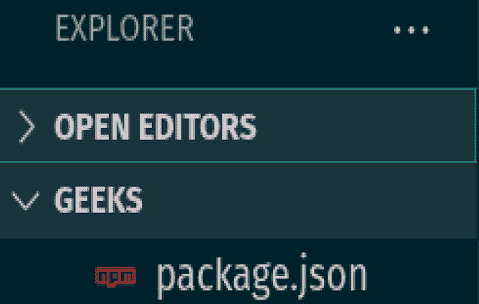
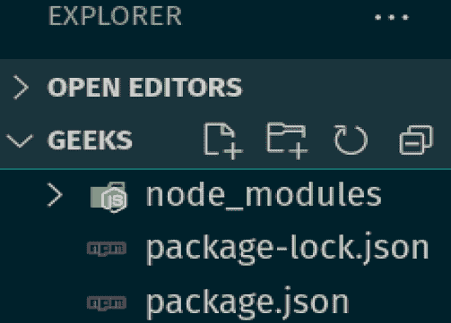
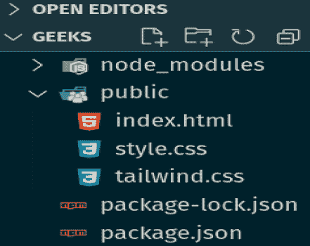
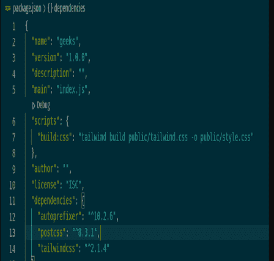
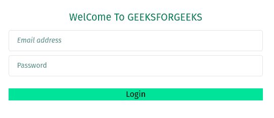

# 如何在顺风 CSS 中只做占位斜体？

> 原文:[https://www . geesforgeks . org/how-to-make-only-placeholder-斜体-tailwind-css/](https://www.geeksforgeeks.org/how-to-make-only-placeholder-italics-in-tailwind-css/)

坦白说，在[顺风 CSS](https://www.geeksforgeeks.org/introduction-to-tailwind-css/) 中没有内置方法让[**占位符**](https://www.geeksforgeeks.org/tailwind-css-placeholder-color/) **斜体**。所以你必须定制你的**实用程序类**，这是 Tailwind CSS 区别于其他 CSS 框架如引导、基础等的主要好处。

Tailwind 提供了现成的实用程序类集，但是很多时候你会遇到需要自己的类的情况，比如创建占位符斜体或者悬停在按钮上增加宽度等等。

**先决条件:**按照以下步骤将自己的实用程序类添加到顺风中。

**步骤 1:** 运行下面的代码到你的文件夹终端。这将创建[T3 文件。](https://www.geeksforgeeks.org/node-js-package-json/)

```
npm init 
```



**第二步:**将下面的代码复制粘贴到你文件夹的终端。这将为顺风创建所需的节点模块。

```
npm install tailwindcss@latest postcss@latest autoprefixer@latest
```



**第三步:**创建一个公共文件夹，在公共文件夹里面添加*****style . CSS、***** **和*****tail wind . CSS***。****

********

******第四步:**在 *tailwind.css* 文件中添加代码。使用这个文件，你可以自定义你的顺风 CSS 以及默认样式。Tailwind 会在构建时将这些指令与它根据您配置的设计系统生成的所有样式进行交换。****

```
**@tailwind base;
@tailwind components;
@tailwind utilities;**
```

******第五步:**打开 **package.json** 文件，在脚本部分下添加以下代码****

```
**"scripts": {
    "build:css": "tailwind build public/tailwind.css -o public/style.css"
  },**
```

********

******第 6 步:**在终端运行以下代码。这将使用预定义的顺风 css 代码填充您的 *style.css* 文件。****

```
**npm run build:css**
```

******第 7 步:**最后，运行下面的代码。这将使用安装**顺风 CSS npm** 包时包含的顺风命令行工具为您的项目生成一个**顺风配置文件**。****

```
**npx tailwindcss init**
```

******注意:**[**::占位符**](https://www.geeksforgeeks.org/css-placeholder-selector/) 是一个 CSS 伪元素，允许您通过更改文本颜色来设置表单元素的占位符文本的样式，并且允许修改文本的样式。****

****将以下代码添加到您的 **tailwind.css** 文件中，这将有助于将占位符设置为斜体。****

******泰风. css******

```
**@tailwind base;
@tailwind components;
@tailwind utilities;

@layer utilities {
  .placeholder-italic::placeholder{
     font-style: italic;
  }
}**
```

****通过使用**@图层指令**，顺风会自动将这些样式移动到与**@顺风工具**相同的位置，以避免意外的[特异性问题](https://www.geeksforgeeks.org/css-specificity/)。现在您可以添加上面的占位符-斜体类以将 [*字体样式*](https://www.geeksforgeeks.org/css-font-style-property/) ***斜体*** 应用到占位符，如下例所示。****

******语法:******

```
**<input class="placeholder-italic" />**
```

******例 1:******

## ****超文本标记语言****

```
**<!DOCTYPE html>
<body class="flex h-screen justify-center items-center">

  <label>Email of Candidate</label>
  <!-- using placeholder-italic in a class to make
       font-style italic of a placeholder-->
  <input class="placeholder-gray-600  w-1/3
                 border text-center border-green-500 
                 placeholder-italic" 
         placeholder="Aman@gfg.com">
</body>

</html>**
```

******输出:******

********

******示例 2:** 在下面的示例中，第一个输入的占位符是*斜体*，第二个输入是非斜体(默认)。****

## ****超文本标记语言****

```
**<!DOCTYPE html>
<body >
        <div class="h-screen flex flex-col 
                    items-center justify-center">
          <p class="text-green-700 text-xl mb-3 ">
             WelCome To GEEKSFORGEEKS
          </p>

          <form >
            <!-- using placeholder-italic class 
                 to create italic input-->
            <input
              aria-label="Enter your email address"
              type="text"
              placeholder="Email address"            
              class="placeholder-italic text-sm text-gray-base
                     w-full mr-3 py-5 px-4 h-2 border 
                     border-gray-200 rounded mb-2"/>
            <input
              aria-label="Enter your password"
              type="password"
              placeholder="Password"
              class="text-sm text-gray-base
                     w-full mr-3 py-5 px-4 h-2
                     border border-gray-200 rounded mb-2"/>

            <button type="submit"
                    class="bg-green-400 w-full mt-4">
              Login
            </button>
          </form>
        </div>
</body>

</html>**
```

******输出:******

********