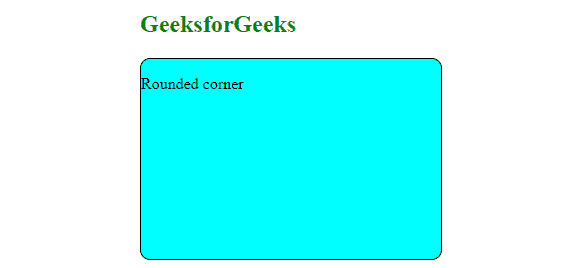
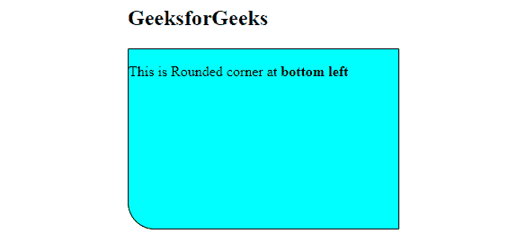
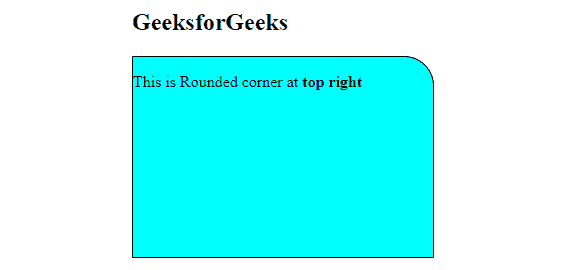
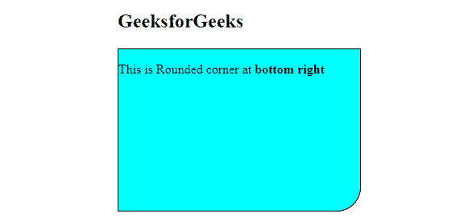
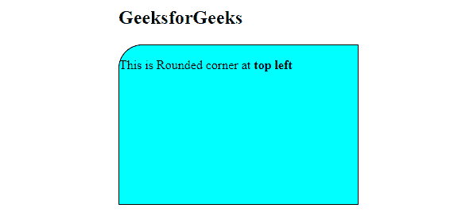

# 如何用 CSS 制作圆角？

> 原文:[https://www . geeksforgeeks . org/如何使用-css/](https://www.geeksforgeeks.org/how-to-make-rounded-corner-using-css/) 制作圆角

为了创建圆角，我们使用 CSS [*边界半径*](https://www.geeksforgeeks.org/css-border-radius-property/) 属性。此属性用于设置元素的边框半径。

**语法:**

```
/* It sets the radius value to all 4 corners */
border-radius: value;
```

**示例 1:** 本示例描述了制作圆角的边界半径。

## 超文本标记语言

```
<!DOCTYPE html>
<html lang="en">

<head>
    <meta charset="UTF-8">
    <meta http-equiv="X-UA-Compatible" content="IE=edge">
    <meta name="viewport" content=
        "width=device-width, initial-scale=1.0">

    <style>
        .container {
            border: 1px solid black;
            width: 300px;
            height: 200px;
            background-color: aqua;         
            /* This set radius to all 4 corners */  
            border-radius: 10px; 
        }
    </style>
</head>

<body>
    <h2 style="color:green">GeeksforGeeks</h2>
    <div class="container">
        <p text-align="center"> Rounded corner</p>
    </div>
</body>

</html>
```

**输出:**



圆角

**示例 2:** 本示例描述了使用边框-左下角-半径属性在左下角制作圆角。

## 超文本标记语言

```
<!DOCTYPE html>
<html lang="en">

<head>
    <meta charset="UTF-8">
    <meta http-equiv="X-UA-Compatible" content="IE=edge">
    <meta name="viewport" 
          content="width=device-width, initial-scale=1.0">

    <style>
        .container {
            border: 1px solid black;
            width: 300px;
            height: 200px;
            background-color: aqua;                             
            border-bottom-left-radius: 30px;  
        }
    </style>
</head>

<body>
    <h2>GeeksforGeeks</h2>
    <div class="container">
        <p text-align="center"> 
            This is Rounded corner at <b>bottom left</b>
        </p>
    </div>
</body>

</html>
```

**输出:**



**示例 3:** 本示例描述了使用 border-右上角-radius 属性在右上角制作圆角。

## 超文本标记语言

```
<!DOCTYPE html>
<html lang="en">

<head>
    <meta charset="UTF-8">
    <meta http-equiv="X-UA-Compatible" content="IE=edge">
    <meta name="viewport" 
          content="width=device-width, initial-scale=1.0">

    <style>
        .container {
            border: 1px solid black;
            width: 300px;
            height: 200px;
            background-color: aqua;                             
            border-top-right-radius: 30px; 
        }
    </style>
</head>

<body>
    <h2>GeeksforGeeks</h2>
    <div class="container">
        <p text-align="center"> 
            This is Rounded corner at <b>top right</b>
        </p>
    </div>
</body>

</html>
```

**输出:**



**示例 4:** 本示例描述了使用 border-bottom-right-radius 属性在右下角制作圆角。

## 超文本标记语言

```
<!DOCTYPE html>
<html lang="en">

<head>
    <meta charset="UTF-8">
    <meta http-equiv="X-UA-Compatible" content="IE=edge">
    <meta name="viewport" 
          content="width=device-width, initial-scale=1.0">

    <style>
        .container {
            border: 1px solid black;
            width: 300px;
            height: 200px;
            background-color: aqua;                             
            border-bottom-right-radius: 30px;  
        }
    </style>
</head>

<body>
    <h2>GeeksforGeeks</h2>
    <div class="container">
        <p text-align="center"> 
            This is Rounded corner at <b>bottom right</b>
        </p>
    </div>
</body>

</html>
```

**输出:**



**示例 5:** 本示例描述了使用边框-左上角-半径属性在左上角制作拐角。

## 超文本标记语言

```
<!DOCTYPE html>
<html lang="en">

<head>
    <meta charset="UTF-8">
    <meta http-equiv="X-UA-Compatible" content="IE=edge">
    <meta name="viewport" 
          content="width=device-width, initial-scale=1.0">

    <style>
        .container {
            border: 1px solid black;
            width: 300px;
            height: 200px;
            background-color: aqua;                             
            border-top-left-radius: 30px;  
        }
    </style>
</head>

<body>
    <h2>GeeksforGeeks</h2>
    <div class="container">
        <p text-align="center"> 
            This is Rounded corner at <b>top left</b>
        </p>
    </div>
</body>

</html>
```

**输出:**



左上角

**人手不够:**

**将半径值应用于所有四个角:**

```
border-radius: value; 
```

**将值 1 应用于左上角和右下角，将值 2 应用于右上角和左下角。**

```
border-radius: value1 value2; 
```

**在左上角应用值 1，在右上角和左下角应用值 2，在右下角应用值 3。**

```
border-radius: value1 value2 value3; 
```

**在左上角应用值 1，在右上角应用值 2，在右下角应用值 3，在左下角应用值 4。**

```
border-radius: value1 value2 value3 value4; 
```