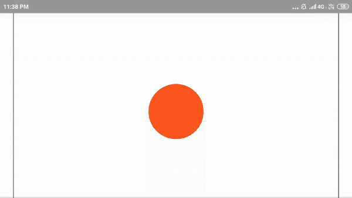
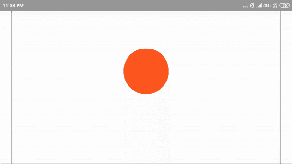

# 如何用 CSS 制作平滑的弹跳动画？

> 原文:[https://www . geesforgeks . org/how-make-smooth-bounce-animation-use-CSS/](https://www.geeksforgeeks.org/how-to-make-smooth-bounce-animation-using-css/)

流畅的弹跳动画可以借助 **HTML** 和 **CSS** 来完成。它将产生有趣和期望的输出。

对于这个项目，在 HTML 页面中需要一个简单的 **div** 和类 **ball** :

```css
<div class="ball"></div>
```

我们将切换到 CSS 进行动画编程。现在用 Flexbox 把球放在页面中间，把球**做成 70px 乘 70px** 的大小。它可以采取任何大小的用户选择，因为它决定了球的大小。

```css
body {
  display: flex;              
  justify-content: center;   
}
.ball {
  width: 100px;
  height: 100px;
  border-radius: 50%;         
  background-color: #FF5722;  
}
```

这里，
`justify-content: center`用于水平居中。
`border-radius : 50%`将正方形变成圆形。
`background-color: #FF5722`将圆圈变成橙色。要记住的颜色有各种代码符号。

**关键帧创建:**CSS 动画中的关键帧可以完全控制动画。简单使用关键字**@关键帧**后跟动画名称，即平滑反弹球:

```css
@keyframes smoothbounceball{
    statements
}
```

在关键帧内，使用从到<font color="green">到</font>的关键词<font color="green">来制作动画的起点和终点。</font>

```css
@keyframes smoothbounceball{
    from {/*starting*/}
    to {/*ending*/}
}
```

据我们了解，我们可以在动画中添加起始值和结束值。为了创建弹跳效果，我们需要变换球的位置。<font color="green">变换</font>允许修改给定元素的坐标。因此，最后一个关键帧:

```css
@keyframes smoothbounceball{
    from { transform: translate3d(0, 0, 0);}
    to { transform: translate3d(0, 200px, 0);}
}
```

这里， **translate3d** 函数接受三个输入，即三维轴(x，y，z)的变化。它会在三维轴上平移球。如果球想上下移动，球需要沿着 y 轴平移。

**运行关键帧:**由于**@关键帧**已经创建，现在需要运行。在上述**法典中。球{ }** ，一个接一个的线必须加:

```css
.ball{
    Given statements...

    animation: bounce 0.5s;
    animation-direction: alternate;
    animation-iteration-count: infinite;
}
```

**动画的理解:**动画告诉**球**元素使用给定的关键帧规则**弹起**并将动画的长度设置为 0.5 秒。然后在结束时，动画方向交替。然后无限次地运行动画。

但它不喜欢球反弹，而是来回上下移动。
因此，它看起来像:


那是因为动画的时间是关闭的。默认情况下，动画设置为<font color="green">缓和</font>。所以，为了看起来像球在弹跳，动画需要在开始时慢，在中间加速，然后慢慢结束。

因此**贝塞尔曲线**用于自定义动画计时。因此，代码:

```css
.ball{
    Given statements..

    animation: bounce 0.5s cubic-bezier(0.5, 0.05, 1, 0.5);
}
```

之后，球显示出弹跳效果。以下是最终代码:

```css
<!DOCTYPE html>
<html>

<head>
    <style>
        body {
            display: flex;
            justify-content: center;
        }

        .ball {
            width: 100px;
            height: 100px;
            border-radius: 50%;
            background-color: #FF5722;
            animation: bounce 0.5s;
            animation-direction: alternate;
            animation-timing-function: cubic-bezier(.5, 0.05, 1, .5);
            animation-iteration-count: infinite;
        }

        @keyframes bounce {
            from {
                transform: translate3d(0, 0, 0);
            }
            to {
                transform: translate3d(0, 200px, 0);
            }
        }
        /* Prefix Support */

        ball {
            -webkit-animation-name: bounce;
            -webkit-animation-duration: 0.5s;
            -webkit-animation-direction: alternate;
            -webkit-animation-timing-function: cubic-bezier(
            .5, 0.05, 1, .5);
            -webkit-animation-iteration-count: infinite;
        }

        @-webkit-keyframes bounce {
            from {
                -webkit-transform: translate3d(0, 0, 0);
                transform: translate3d(0, 0, 0);
            }
            to {
                -webkit-transform: translate3d(0, 200px, 0);
                transform: translate3d(0, 200px, 0);
            }
        }
    </style>
</head>

<body>
    <div class="ball"></div>
</body>

</html>
```

**输出:**
