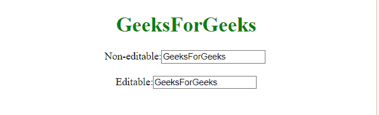
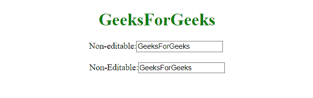

# 如何使用 CSS 使文本输入不可编辑？

> 原文:[https://www . geesforgeks . org/如何制作-文本-输入-不可编辑-使用-css/](https://www.geeksforgeeks.org/how-to-make-text-input-non-editable-using-css/)

HTML 中的[只读属性](https://www.geeksforgeeks.org/html-readonly-attribute/)用于创建不可编辑的文本输入。但是在 CSS 的情况下，指针事件属性用于停止指针事件。

**语法:**

```html
pointer-events: none;
```

**示例 1:** 本示例显示两个输入文本，其中一个不可编辑。

```html
<!DOCTYPE html> 
<html> 
    <head> 
        <title> 
            Disable Text Input field
        </title> 

        <style>
        .inputClass {
            pointer-events: none; 
        }
        </style>
    </head> 

    <body style = "text-align:center;"> 

        <h1 style = "color:green;" > 
            GeeksForGeeks 
        </h1> 

        Non-editable:<input class="inputClass"
            name="input" value="GeeksForGeeks">

        <br><br>

        Editable:<input class="inputClass2"
            name="input" value="GeeksForGeeks">
    </body> 
</html>                    
```

**输出:**


**示例 2:** 本示例创建两个输入文本，两个文本都不可编辑。

```html
<!DOCTYPE html> 
<html>
   <head>
      <title> 
         Disable Text Input field
      </title>

      <style>
         .inputClass {
            pointer-events: none; 
         }
      </style>
   </head>

   <body style = "text-align:center;">

      <h1 style = "color:green;" > 
         GeeksForGeeks 
      </h1>

      Non-editable:<input class="inputClass"
        name="input" value="GeeksForGeeks">

      <br><br>

      Non-Editable:<input class="inputClass"
        name="input" value="GeeksForGeeks">
   </body>
</html>
```

**输出:**
