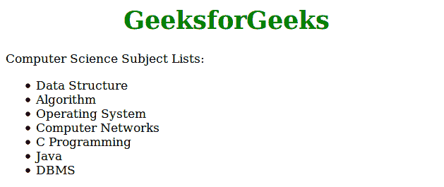

# 当用户使用 CSS 将光标悬停在列表项上时，如何使光标到手？

> 原文:[https://www . geesforgeks . org/如何在用户将光标悬停在列表项上时将光标移动到手上-使用 css/](https://www.geeksforgeeks.org/how-to-make-the-cursor-to-hand-when-a-user-hovers-over-a-list-item-using-css/)

当用户悬停在项目列表上时，使用 CSS 属性创建光标。首先使用 HTML ul 和

*   Create a tag list of items, and then use CSS properties: hover over the cursor: grab; Hover the cursor over the list of items.

**语法:**

```html
element:hover {
    cursor:grab/pointer;
}
```

**例 1:**

```html
<!DOCTYPE html>
<html>
    <head>
        <title>make cursor to hand</title>
        <style>
            body {
                width:70%;    
            }
            h1 {
                color:green;
                text-align:center;
            }
            li:hover{
                cursor:grab;
            }
        </style>
    </head>
    <body>
        <h1>GeeksforGeeks</h1>
        <div class = "sub">Computer Science Subject Lists:</div>
        <ul>
            <li>Data Structure</li>
            <li>Algorithm</li>
            <li>Operating System</li>
            <li>Computer Networks</li>
            <li>C Programming</li>
            <li>Java</li>
            <li>DBMS</li>
        </ul>    
    </body>
</html>
```

**输出:**


**示例 2:** 本示例包含更改光标指针替代的 CSS 属性。在这个例子中，使用第 n 个子(2n+1)作为光标:抓取；并使用第 n 个子(2n+2)作为光标:指针；。

```html
<!DOCTYPE html>
<html>
    <head>
        <title>make cursor to hand</title>
        <style>
            body {
                width:60%;    
            }
            h1 {
                color:green;
                text-align:center;
            }
            li {
                font-size:20px;
            }
            li:nth-child(2n+1) {
                background: green;
                cursor:grab;
                width:50%;
                padding:5px;
            }
            li:nth-child(2n+2) {
                background: #CCC;
                cursor:pointer;
                width:50%;
                padding:5px;
            }
        </style>
    </head>
    <body>
        <h1>GeeksforGeeks</h1>
        <div class = "sub">Computer Science Subject Lists:</div>
        <ul>
            <li>Data Structure</li>
            <li>Algorithm</li>
            <li>Operating System</li>
            <li>Computer Networks</li>
            <li>C Programming</li>
            <li>Java</li>
            <li>DBMS</li>
        </ul>    
    </body>
</html>
```

**输出:**
