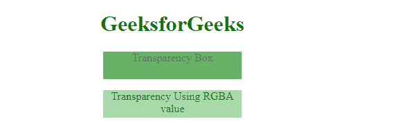

# 如何用 CSS 制作透明网页？

> 原文:[https://www . geesforgeks . org/how-to-make-transparent-web-page-use-CSS/](https://www.geeksforgeeks.org/how-to-make-transparent-web-page-using-css/)

您可以使用 HTML 中的[**【不透明度】**](https://www.geeksforgeeks.org/css-opacity-transparency/) 属性轻松制作透明网页。您只需要在 0.0 到 1.0 之间调整不透明度值，其中低值表示高透明度，高值表示低透明度。

为了使任何元素透明，您需要向元素的父元素添加 CSS *不透明度*属性。

您可以使用两种方法制作透明的网页。

*   **透明度框:**使用*不透明度*为元素的背景添加透明度，使其所有子元素继承相同的透明度。
*   **使用 RGBA 值的透明度:***不透明度*属性仅用于向元素的背景添加透明度。

**示例 1:** 在下面的示例中，当向*透明度框*添加*不透明度*时，其子元素也最终具有透明度，但是当使用 **rgba、**使用透明度时，它仅向背景元素添加透明度。因此，让我们将透明度属性添加到我们的网页中。

## 超文本标记语言

```css
<!DOCTYPE html>
<html>

<head>
    <style>
        h1 {
            color: green;
        }

        .box {
            opacity: 0.6;
            background-color: green;
            height: 40px;
            width: 200px
        }

        .rgba {
            opacity: 0.8;
            background-color: green;
            background: rgba(76, 175, 80, 0.6);
            height: 40px;
            width: 200px
        }
    </style>
</head>

<body>
    <center>
        <h1>GeeksforGeeks</h1>

        <div class="box">

<p>Transparency Box</p>

        </div>
        <div class="rgba">

<p>Transparency Using RGBA value</p>

        </div>
    </center>
</body>

</html>                                   
```

**输出:**



使用不透明度属性值的透明度

**示例 2:** 按照步骤创建透明的网页，就像制作透明的登录表单一样。

**第一步:**添加 HTML。添加电子邮件、密码和登录按钮的输入。在它们周围包装一个“表单”元素来处理输入。

**步骤 2:** 添加一个必需的 CSS，使用 RGBA 值为登录表单设计一个透明的登录页面，如上所述。CSS 属性像 [*线性-渐变*](https://www.geeksforgeeks.org/css-linear-gradient-function/) 和 [*框影*](https://www.geeksforgeeks.org/css-box-shadow-property/) 达到想要的效果。

## 超文本标记语言

```css
<!DOCTYPE html>
<html>

<head>
    <style>
        h1 {
            color: green;
        }

        body {
            background: linear-gradient(to right,
                #12c2e9, #c471ed, #f64f59);
        }

        .form {
            width: 300px;
            height: 300px;
            display: grid;
            place-content: center;

            /* Add a transparency to the background
               using rgba value */
            background: rgba(255, 255, 255, 0.1);

            /* Add a transparency to shadow */
            box-shadow: 0 26px 42px rgba(0, 0, 0, 0.1);
        }

        input,
        button {
            box-sizing: border-box;
            width: 100%;
            margin: 20px auto;
            padding: 12px 20px;
            border: none;
            background: rgba(255, 255, 255, 0.1);
            box-shadow: 0 13px 21px rgba(0, 0, 0, 0.05);
        }
    </style>
</head>

<body>
    <center>
        <h1>GeeksforGeeks</h1>

        <form class="form">
            <input type="text" placeholder="xyz@gmail.com" /><br>
            <input type="password" placeholder="Enter Password" />
            <br>
            <button type="submit">Login</button>
        </form>
    </center>
</body>

</html>
```

**输出:**

