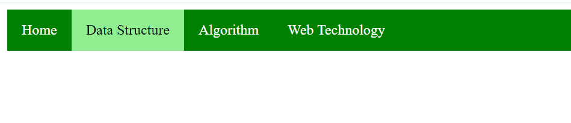

# 如何用 CSS 使导航栏中某个列表项的整个区域都是可点击的？

> 原文:[https://www . geesforgeks . org/如何使用-css/](https://www.geeksforgeeks.org/how-to-make-whole-area-of-a-list-item-in-navigation-bar-is-clickable-using-css/) 制作导航栏中的整个列表区域项目

当我们使用列表项创建导航栏菜单时，整个列表区域都是可点击的。整个区域可点击，使得导航栏 UI 更加用户友好。

在手机或平板电脑上，当触摸手势出现时，有时很难用手指锁定小链接。主要是因为它主要是为桌面使用而设计的。因此，为了使导航栏中列表项的整个区域都可以作为链接点击，下面介绍一些方法:

**使用简单的 CSS 属性:**首先，我们将使用 HTML 创建无序列表项，然后对这些项应用一些 CSS 属性来制作导航栏菜单。

**示例:**

```html
<!DOCTYPE html>
<html lang="en">

<head>
    <meta charset="UTF-8">
    <meta name="viewport" content=
        "width=device-width, initial-scale=1.0">
    <title>navbar</title>
    <style>
        ul {
            list-style-type: none;
            margin: 0;
            padding: 0;
            overflow: hidden;
            background-color: green;
        }

        li {
            float: left;
        }

        li a {
            display: block;
            color: white;
            text-align: center;
            padding: 14px 16px;
            text-decoration: none;
        }

        li a:hover {
            background-color: lightgreen;
            color: black;
        }
    </style>
</head>

<body>
    <ul>
        <li><a href="#">Home</a></li>
        <li><a href="#">Data Structure</a></li>
        <li><a href="#">Algorithm</a></li>
        <li><a href="#">Web Technology</a></li>
    </ul>
</body>

</html>
```

**输出:**


**使用:after(或:before)伪元素:**在这个方法中，我们将使用伪选择器将 CSS 属性设置为锚点元素。

**示例:**

```html
<!DOCTYPE html>
<html lang="en">

<head>
    <meta charset="UTF-8">
    <meta name="viewport" content=
        "width=device-width, initial-scale=1.0">

    <title>Document</title>

    <style>
        #nav {
            background-color: #187446;
            margin: 0px;
            overflow: hidden;
        }

        #nav ul {
            list-style-type: none;
            margin: 0px;
            float: left;
        }

        #nav li {
            display: inline;
            float: left;
            padding: 15px 10px;
        }

        #nav a {
            color: white;
            font-family: Helvetica, Arial, sans-serif;
            text-decoration: none;
        }

        a {
            position: relative;
        }

        #nav a:after {
            content: '';
            position: absolute;
            top: -10px;
            bottom: -10px;
            left: -10px;
            right: -10px;
        }

        #nav li:hover {
            background-color: lightgreen;
        }

        #nav a:hover {
            color: black;
        }
    </style>
</head>

<body>
    <div id="nav">
        <ul>
            <li><a href="#">Home</a></li>
            <li><a href="#">Data Structure</a></li>
            <li><a href="#">Algorithm</a></li>
            <li><a href="#">Web Technology</a></li>
        </ul>
    </div>
</body>

</html>
```

**输出:**
