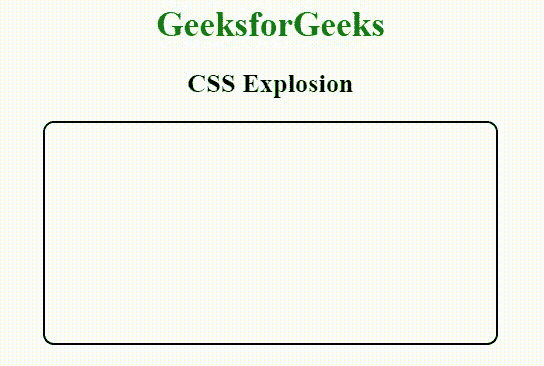
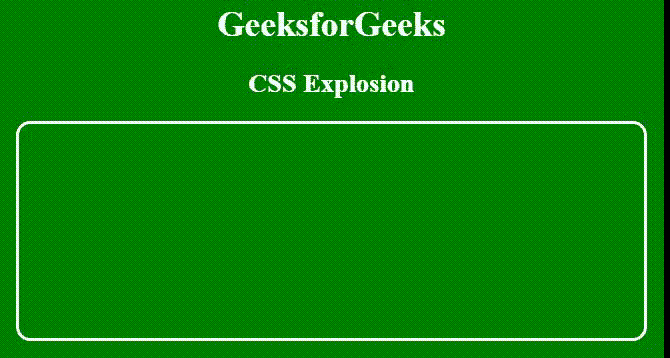

# 如何管理 CSS 爆炸？

> 原文:[https://www.geeksforgeeks.org/how-to-manage-css-explosion/](https://www.geeksforgeeks.org/how-to-manage-css-explosion/)

**爆炸:**CSS 爆炸基本上是指一个 HTML 块被触摸或点击时的爆炸。这是通过运动方程来实现的。它广泛出现在大行代码中。CSS 爆炸无法完全阻止。它可以通过采取某些措施来减少。

**示例:**本示例使用 CSS 属性创建和管理爆炸。

```css
<!DOCTYPE html>
<html>

<head>

    <!-- CSS style to create explosion -->
    <style>

        /* Set the content into center */
        body {
            text-align:center;
        }

        /* Set h1 color to green */
        h1 {
            color:green;
        }

        /* Set style of container div */
        .container {
            width: 100%;
            background: white;
            display: flex;
            justify-content: center;
            align-items: center;
            z-index: 1;
        }

        /* Style to create a div box */
        .exploding-card {
            width: 50%;
            height: 200px;
            border: solid 2px black;
            border-radius: 10px;
            overflow: hidden;
            z-index: 0;
        }

        /* Style to create explosion */
        .explosion {
            position: fixed;
            width: 1px;
            height: 1px;
            transform: scale(1);
            border-radius: 80%;
            animation-delay: 0ms;
            background: blue;
        }

        /* Style to set animation */
        .exploding-card:active .explosion {
            animation-name: colors;
            animation-duration: 0.75s;
            animation-fill-mode: forwards;
        }
        @keyframes colors {
            0% {
                transform: scale(1);
            }
            100% {
                transform: scale(1000);
            }
        }
    </style>
</head>

<body>
    <h1>GeeksforGeeks</h1>
    <h2>CSS Explosion</h2>

    <div class="container">
        <div class="card exploding-card">
            <div class="explosion"></div>
        </div>
    </div>
</body>

</html>                    
```

**输出:**


**示例 2:** 本示例使用 CSS 属性创建和管理爆炸。

```css
<!DOCTYPE html>
<html>

<head>

    <!-- CSS style to create explosion -->
    <style>

        /* Set the content into center */
        body {
            text-align:center;
            background-color:green;
        }

        /* Set h1 color to green */
        h1, h2 {
            color:white;
        }

        /* Set style of container div */
        .container {
            width: 100%;
            display: flex;
            justify-content: center;
            z-index: 1;
        }

        /* Style to create a div box */
        .exploding-card {
            width: 70%;
            height: 200px;
            border: solid 3px white;
            box-sizing: border-box;
            border-radius: 13px;
            overflow: hidden;
            z-index: 0;
        }

        /* Style to create explosion */
        .explosion {
            position: fixed;
            width: 2px;
            height: 3px;
            transform: scale(1);
            border-radius: 50%;
            background: white;
        }

        /* Style to set animation */
        .exploding-card:active .explosion {
            animation-name: colors;
            animation-duration: 2s;
            animation-fill-mode: forwards;
        }
        @keyframes colors {
            100% {
                transform: scale(1);
            }
            0% {
                transform: scale(1000);
            }
        }
    </style>
</head>

<body>
    <h1>GeeksforGeeks</h1>
    <h2>CSS Explosion</h2>

    <div class="container">
        <div class="exploding-card">
            <div class="explosion"></div>
        </div>
    </div>
</body>

</html>                    
```

**输出:**
