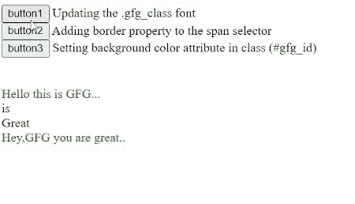
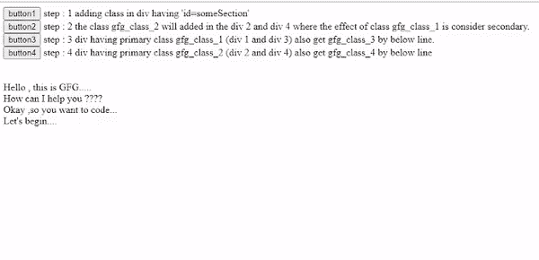
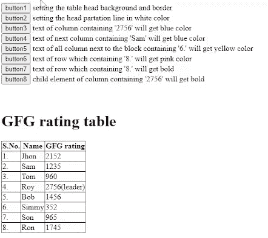

# 如何使用 jQuery 库修改 CSS 类？

> 原文:[https://www . geesforgeks . org/如何修改-CSS-class-use-jquery-library/](https://www.geeksforgeeks.org/how-to-modify-css-class-using-jquery-library/)

在本文中，我们将讨论如何使用 [jQuery](https://www.geeksforgeeks.org/jquery-tutorials/) 修改 [css](https://www.geeksforgeeks.org/css-tutorials/) 类。这是 jQuery 的主要应用之一。当我们必须为 HTML 的特定元素添加动态样式时，我们通常会使用它。例如，动态更改特定类内容的颜色。

**方法:**我们将使用 [addclass(](https://www.geeksforgeeks.org/jquery-addclass-with-examples/) )、 [css()](https://www.geeksforgeeks.org/jquery-css-method/) 以及 jQuery 库中的一些其他方法来修改 HTML 元素的 css。让我们通过下面的例子来理解这个应用。

**示例 1:** 在下面这个示例中，我们正在修改类(“。gfg_class)使用 jQuery。

## 超文本标记语言

```html
<!DOCTYPE HTML>
<html lang='en'>

<head>
    <meta charset='utf-8'>
    <title>JQuery Examples</title>
    <script src=
"https://ajax.googleapis.com/ajax/libs/jquery/3.5.1/jquery.min.js">
    </script>
    <style>
        .gfg_class {
            color: green;
        }
    </style>
    <script>
        $(() => {

            // Updating the .gfg_class font
            $("#button1").click(function () {
                $(".gfg_class").css("font-size", "24pt");
            });

            // Adding border property to the span selector
            $("#button2").click(function () {
                $("span").css("border", "1px solid green");
            });

            // Setting background color attribute in class (#gfg_id)
            $("#button3").click(function () {
                $("#gfg_id").css("background", "green");
            });
        });
    </script>

</head>

<body>
    <input type="button"
           id="button1"
           value='button1' />
        Updating the .gfg_class font<br>

    <input type="button"
           id="button2"
           value='button2' />
        Adding border property to the span selector<br>

    <input type="button"
           id="button3"
           value='button3' />
        Setting background color attribute in class (#gfg_id)
    <br><br><br>

    <span class='gfg_class'>
      Hello this is GFG...
    </span>

    <br>
    <span>is</span><br>
    <span id='gfg_id'>Great</span>
    <br>

    <span class='gfg_class'>
      Hey,GFG you are great..
    </span>
    <br>
</body>

</html>
```

**输出:**通过使用文本编辑器创建. html 文件来运行上述代码。



**示例 2:** 在本例中，您将了解“如何在除法中添加类？”，为了正确理解它的一些属性，请跟随注释并与下面的输出进行比较。

## 超文本标记语言

```html
<!DOCTYPE HTML>
<html lang='en'>

<head>
    <meta charset='utf-8'>
    <title>JQuery Examples</title>

    <style>
        .gfg_class_1 {
            color: green;
            font-style: italic;
        }

        .gfg_class_2 {
            color: red;
        }

        .gfg_class_3 {
            font-size: 40pt;
        }

        .gfg_class_4 {
            font-size: 12pt;
        }
    </style>

    <script src=
"https://ajax.googleapis.com/ajax/libs/jquery/3.5.1/jquery.min.js">
    </script>
    <script>
        $(() => {
            // adding class in div having 'id=someSection'
            $("#button1").click(function () {
                $("#someSection > div").addClass("gfg_class_1");
            });

            $("#button2").click(function () {
                $("#someSection div:not('.gfg_class_1')")
                  .addClass("gfg_class_2");
            });

            // Div ahving class gfg_class_1 and
            // gfg_class_3 by below line
            $("#button3").click(function () {
                $("#someSection div.gfg_class_1")
                  .addClass("gfg_class_3");
            });

            $("#button4").click(function () {
                $("#someSection div.gfg_class_2")
                  .addClass("gfg_class_4");
            });
        });
    </script>
</head>

<body>
    <input type="button" id="button1" value='button1' />
      step : 1 adding class in div having 'id=someSection'
    <br>
    <input type="button" id="button2" value='button2' />
      step : 2 the class gfg_class_2 will added in the div 2 and div 4
      where the effect of class gfg_class_1 is consider secondary.
    <br>

    <input type="button" id="button3" value='button3' />
      step : 3 div having primary class gfg_class_1 (div 1 and div 3)
      also get gfg_class_3 by below line.
    <br>

    <input type="button" id="button4" value='button4' />
    step : 4 div having primary class gfg_class_2 (div 2 and div 4)
    also get gfg_class_4 by below line

    <br><br><br>
    <div id='someSection'>
        <div>
            Hello,this is GFG.....
            <div>
                How can I help you ????
            </div>
        </div>
        <div>
            Okay ,so you want to code...
            <div>
                Let's begin....
            </div>
        </div>
    </div>
</body>

</html>
```

**输出:**通过使用文本编辑器创建. html 文件来运行上述代码。



**示例 3:** 在本例中，您将了解“如何在表中添加类？，以及“如何在表的不同块、行和列中设置不同类型的样式？为了正确理解，请遵循注释并与以下输出进行比较。

## 超文本标记语言

```html
<!DOCTYPE HTML>
<html lang='en'>

<head>
    <meta charset='utf-8'>
    <title>JQuery Examples</title>
    <style>
        .tbl {
            border: 1px solid black;
            border-collapse: collapse;
        }
    </style>
    <script src=
"https://ajax.googleapis.com/ajax/libs/jquery/3.5.1/jquery.min.js">
    </script>
    <script>
        $(() => {
            // Adding class tbl in table
            $("table").addClass("tbl");
            $("table th").addClass("tbl");
            $("table td").addClass("tbl");

            // Setting the table head background and border
            $("#button1").click(function () {
                $("table thead").css("background", "gray");
                $("table thead").css("color", "white");
            });

            // Setting the head partation line in white color
            $("#button2").click(function () {
                $("table th:nth-child(2)")
                  .css("border-right", "1px solid white");
                $("table th:nth-child(1)")
                  .css("border-right", "1px solid white");
            });

            // Setting alternative background color (on even position)
            $("#button3").click(function () {
                $("table tbody tr").filter(":even")
                  .css("background", "lightgray");
            });

            // Text of column containing '2756' will get blue color
            $("#button3").click(function () {
                $("table tbody td:contains('2756')")
                  .css("color", "blue");
            });

            // Text of next column containing 'Sam' will get blue color
            $("#button4").click(function () {
                $("table tbody td:contains('Sam')")
                  .next().css("color", "brown");
            });

            // Text of all  column next to the block containing
            // '6.' will get yellow color
            $("#button5").click(function () {
                $("table tbody td:contains('6.')")
                  .nextAll().css("color", "yellow");
            });

            // Text of row which containing '8.' will get pink color
            $("#button6").click(function () {
                $("table tbody td:contains('8.')")
                  .nextAll().addBack().css("color", "pink");
            })

            // Text of row which containing '8.' will get bold
            $("#button7").click(function () {
                $("table tbody td:contains('Son')")
                  .parent().css("font-weight", "bold");
            });

            // Child element of column containing '2756' will get bold
            $("#button8").click(function () {
                $("table tbody td:contains('2756')")
                  .children().css("font-weight", "bold");
            });
        });
    </script>
</head>

<body>
    <input type="button"
           id="button1"
           value='button1' />
      setting the table head background and border
    <br>

    <input type="button"
           id="button2"
           value='button2' />
      setting the head partation line in white color
    <br>

    <input type="button"
           id="button3"
           value='button3' />
      text of column containing '2756' will get blue color
    <br>

    <input type="button"
           id="button4"
           value='button4' />
      text of next column containing 'Sam' will get blue color
    <br>

    <input type="button"
           id="button5"
           value='button5' />
      text of all column next to the block containing '6.'
      will get yellow color
    <br>

    <input type="button"
           id="button6"
           value='button6' />
      text of row which containing '8.' will get pink color
    <br>

    <input type="button"
           id="button7"
           value='button7' />
      text of row which containing '8.' will get bold
    <br>

    <input type="button"
           id="button8"
           value='button8' />
      child element of column containing '2756' will get bold
    <br><br><br>
    <h1>GFG rating table</h1>
    <table>
        <thead>
            <tr>
                <th>S.No.</th>
                <th>Name</th>
                <th>GFG rating</th>
            </tr>
        </thead>
        <tbody>
            <tr>
                <td>1.</td>
                <td>Jhon</td>
                <td>2152</td>
            </tr>
            <tr>
                <td>2.</td>
                <td>Sam</td>
                <td>1235</td>
            </tr>
            <tr>
                <td>3.</td>
                <td>Tom</td>
                <td>960</td>
            </tr>
            <tr>
                <td>4.</td>
                <td>Roy</td>
                <td>2756<span>(leader)</span> </td>
            </tr>
            <tr>
                <td>5.</td>
                <td>Bob</td>
                <td>1456</td>
            </tr>
            <tr>
                <td>6.</td>
                <td>Simmy</td>
                <td>352</td>
            </tr>
            <tr>
                <td>7.</td>
                <td>Son</td>
                <td>965</td>
            </tr>
            <tr>
                <td>8.</td>
                <td>Ron</td>
                <td>1745</td>
            </tr>

        </tbody>
    </table>
</body>

</html>
```

**输出:**通过使用文本编辑器创建. html 文件来运行上述代码。

