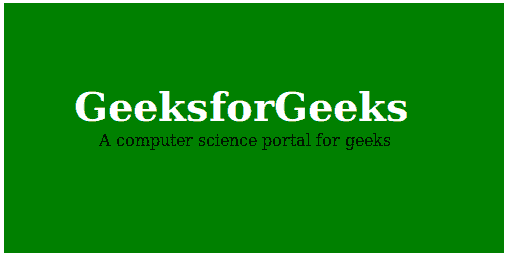
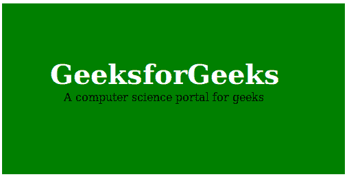
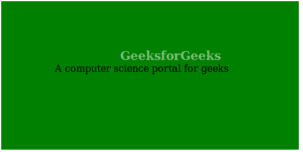

# 如何使用 CSS 将一个 div 叠加到另一个 div 上

> 原文:[https://www . geesforgeks . org/how-over-one-div-over-other-div-using-CSS/](https://www.geeksforgeeks.org/how-to-overlay-one-div-over-another-div-using-css/)

创建一个叠加效果仅仅意味着将两个 div 放在同一个地方，但是两个 div 都在需要的时候出现，也就是说，当悬停或者点击其中一个 div 以使第二个 div 出现的时候。覆盖非常干净，给网页一个整洁的外观。它看起来很复杂，设计也很简单。可以使用两个简单的 CSS 属性创建覆盖:

*   z 指数
*   位置

**例 1:**

```css
<!DOCTYPE html>
<html>
    <head>
        <title>overlay div</title>
        <style>
            .geeks {
                position: absolute;
                height: 250px;
                width: 500px;
                background-color:green;
            }
            .gfg {
                color:white;
                padding-top:80px;
                padding-left:70px;
                font-size:40px;
                font-weight:bold;
            }
            .g4g {
                padding-left:95px;
            }
        </style>
    </head>
    <body>
        <div class = "geeks">
            <div class = "gfg">GeeksforGeeks</div>
            <div class = "g4g">A computer science portal for geeks</div>
        </div>
    </body>
</html>                    
```

**输出:**


**注意:**通过给页面增加更多的 CSS 自定义叠加效果，让页面看起来更加优雅。

**例 2:**

```css
<!DOCTYPE html>
<html>
    <head>
        <title>overlay div</title>
        <style>
            .geeks {
                position: absolute;
                height: 250px;
                width: 500px;
                background-color:green;
            }
            .gfg {
                color:white;
                padding-top:80px;
                padding-left:70px;
                font-size:40px;
                font-weight:bold;
            }
            .g4g {
                padding-left:90px;
            }
            .gfg:hover {
                z-index: -1;
                opacity: 0.5;
                font-size:20px;
                text-align:center;
                transform-style:all;
                transition-duration: 1s;
            }
            .g4g:hover {
                z-index: -1;
                opacity: 0.3;
                font-size:40px;
                text-align:center;
                transform-style:all;
                transition-duration: 1s;
            }
        </style>
    </head>
    <body>
        <div class = "geeks">
            <div class = "gfg">GeeksforGeeks</div>
            <div class = "g4g">A computer science portal for geeks</div>
        </div>
    </body>
</html>                    
```

**输出:**
悬停前:
T5】悬停后:
