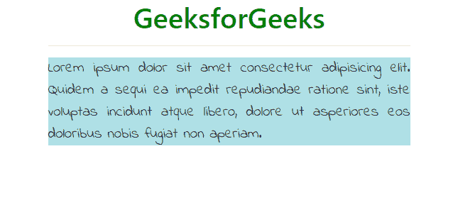

# 如何用另一个 CSS 类覆盖一个类的 CSS 属性？

> 原文:[https://www . geeksforgeeks . org/如何使用另一个 css 类覆盖一个类的 css 属性/](https://www.geeksforgeeks.org/how-to-override-the-css-properties-of-a-class-using-another-css-class/)

要使用另一个类覆盖一个类的 CSS 属性，我们可以使用**！重要的**指令。在 CSS 中，！重要表示**“这很重要”**，具有该指令的**属性:value** 对即使其他元素具有更高的特异性也始终适用。

**语法:**

```html
element1 {
    property-x: value_y  !important; /* This will be applied. */
}
element2 {
    property-x: value_z; /* This will not be applied. */
}

```

**示例:**

```html
<!DOCTYPE html>
<html>

<head>
    <title>!important</title>
    <meta charset="utf-8">
    <meta name="viewport" 
          content="width=device-width, initial-scale=1">
    <link rel="stylesheet" 
          href=
"https://maxcdn.bootstrapcdn.com/bootstrap/4.3.1/css/bootstrap.min.css">
    <link href=
"https://fonts.googleapis.com/css?family=Indie+Flower&display=swap" 
          rel="stylesheet">
    <link href=
"https://fonts.googleapis.com/css?family=Mansalva&display=swap"
          rel="stylesheet">
    <style>
        h1 {
            text-align: center;
            color: green;
        }

        .my_fav_font {
            font-family: 'Indie Flower', cursive !important;
            /* This will be applied. */
        }

        .my_para {
            font-family: 'Mansalva', cursive;
            /* This will not be applied. */
            text-align: justify;
            background-color: powderblue;
            font-size: 130%;
        }
    </style>
</head>

<body>
    <div class="container">
        <h1>GeeksforGeeks</h1>
        <hr/>
        <p class="my_fav_font my_para">Cascading Style Sheets,
        fondly referred to as CSS, is a simply designed language
        intended to simplify the process of making web pages
        presentable. CSS allows you to apply styles to web pages.
        More importantly, CSS enables you to do this independent 
        of the HTML that makes up each web page.</p>
    </div>
</body>

</html>
```

**输出:**
