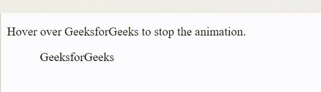
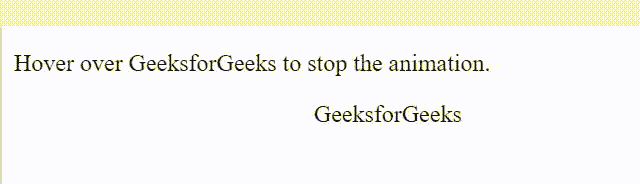

# 如何使用 CSS 暂停/播放动画？

> 原文:[https://www . geesforgeks . org/how-pause-play-animation-use-CSS/](https://www.geeksforgeeks.org/how-to-pause-play-animation-using-css/)

**CSS** 有助于在不使用 JavaScript 的情况下动画化 HTML 元素。您可以使用 CSS 的 ***动画-播放-状态*** 属性来播放和暂停应用于 HTML 元素的动画。

#### ***动画-播放-状态*** 属性有 2 个值:

*   **暂停**–暂停正在进行的动画。
*   **运行**–开始暂停动画(默认值)。

#### 请遵循以下步骤:

*   创建 HTML 文件
*   创建 CSS 文件:
    1.  为 **< div >** 标签指定*位置*属性。
    2.  使用*动画*属性来提及您想要给 **< div >** 标签的动画。
    3.  使用*动画-播放-状态*属性播放/暂停动画。
    4.  提到关键帧*属性*’*从“*和“*到“*来提到动画的开始和结束。

**示例 1:** 播放动画的 HTML 和 CSS 代码。

## 超文本标记语言

```css
<!DOCTYPE html>
<html>

<head>
    <style>
        div {
            position: relative;
            animation: geeks 5s infinite;
            animation-play-state: paused;
        }

        div:hover {
            animation-play-state: running;
        }

        @keyframes geeks {
            from {
                left: 0px;
            }
            to {
                left: 100px;
            }
        }
    </style>
</head>

<body>
    <p>
        Hover over the GeeksforGeeks 
        to run the animation.
    </p>

    <div>GeeksforGeeks</div>
</body>

</html>
```

**输出:**



**悬停时播放动画**

**示例 2:** 暂停动画的 HTML 和 CSS 代码。

## 超文本标记语言

```css
<!DOCTYPE html>
<html>

<head>
    <style>
        div {
            position: relative;
            animation: geeks 5s infinite;
        }

        div:hover {
            animation-play-state: paused;
        }

        @keyframes geeks {
            from {
                left: 0px;
            }
            to {
                left: 100px;
            }
        }
    </style>
</head>

<body>
    <p>
        Hover over the GeeksforGeeks 
        to stop the animation.
    </p>

    <div>GeeksforGeeks</div>
</body>

</html>
```

**输出:**



**悬停时暂停动画**