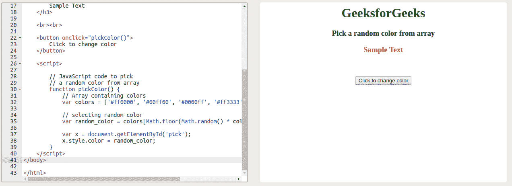
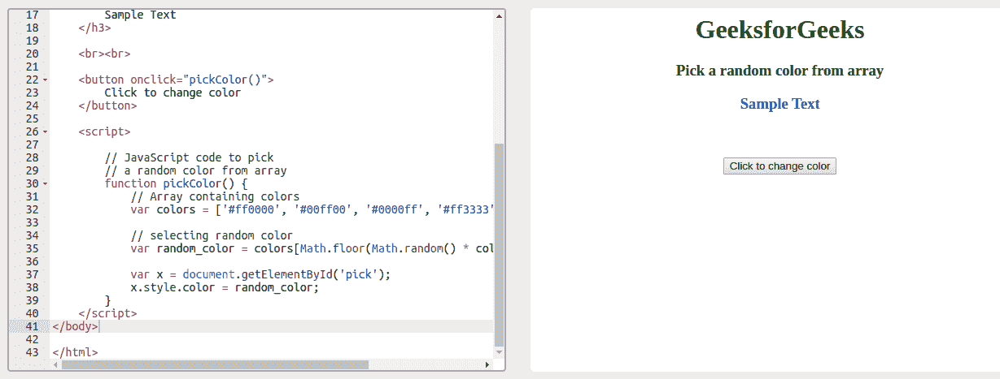

# 如何使用 CSS 和 JavaScript 从数组中随机挑选颜色？

> 原文:[https://www . geesforgeks . org/如何使用 css 和 javascript 从数组中随机选择颜色/](https://www.geeksforgeeks.org/how-to-pick-a-random-color-from-an-array-using-css-and-javascript/)

任务是使用 CSS 从一个数组中选择一种随机的颜色。没有办法只用 CSS 做到这一点。CSS 不支持逻辑语句，因为 CSS 是纯粹确定性的(CSS 中没有数组等东西)。我们可以使用客户端 JavaScript 从数组中选择一种随机颜色。

下面的程序说明了使用客户端 JavaScript 的解决方案:
**示例:**

```css
<!DOCTYPE html>
<html>

<head>
    <title>
        pick a random color from array
    </title>
</head>

<body style="text-align:center;">

    <h1 style="color:green;">
        GeeksforGeeks
    </h1>

    <h3>Pick a random color from array</h3>

    <h3 id="pick" style="color:red;">
        Sample Text
    </h3>

    <br><br>

    <button onclick="pickColor()">
        Click to change color
    </button>

    <script>

        // JavaScript code to pick 
        // a random color from array
        function pickColor() {

            // Array containing colors
            var colors = [
                '#ff0000', '#00ff00', '#0000ff',
                '#ff3333', '#ffff00', '#ff6600'
            ];

            // selecting random color
            var random_color = colors[Math.floor(
                    Math.random() * colors.length)];

            var x = document.getElementById('pick');
            x.style.color = random_color;
        } 
    </script>
</body>

</html>
```

**输出:**

*   **点击按钮前:**
    
*   **点击按钮后:**
    

除了上面的解决方案，我们还可以使用类似 [SASS](https://sass-lang.com/) 这样的 CSS 预处理程序。即使你使用 SASS，你也必须预处理你的样式表，这意味着你必须编译它。
要了解更多关于 SASS 的信息，[点击这里](https://www.geeksforgeeks.org/css-preprocessor-sass/)。