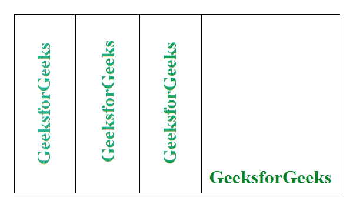

# 如何使用 CSS 并排放置两个高度相同的 div？

> 原文:[https://www . geesforgeks . org/how-to-place-two-div-并排同高使用-css/](https://www.geeksforgeeks.org/how-to-place-two-div-side-by-side-of-the-same-height-using-css/)

相同高度的两个或多个不同 div 可以使用 CSS 并排放置。使用 CSS 属性设置 div 的高度和宽度，使用 display 属性以并排格式放置 div。
使用的显示属性如下:

*   **显示:表格；**该属性用于行为类似于表的元素(div)。
*   **显示:表格-单元格；**该属性用于行为类似于 td 的元素(div)。
*   **显示:表-行:**该属性用于行为类似 tr 的元素(div)。

**例 1:**

## 超文本标记语言

```html
<!DOCTYPE html>
<html>
    <head>
        <style>
            h1 {
                text-align:center;
                color:green;
            }
            body {
                width:70%;
            }
            .container .box {
               display : flex;
              flex-direction : row;

            }

            .container .box .box-cell.box1 {
                background:green;
                color:white;
                text-align:justify;
             }
            .container .box .box-cell.box2 {
                background:lightgreen;
                text-align:justify
            }
        </style>
    </head>
    <body>
        <h1>GeeksforGeeks</h1>
        <div class="container">
            <div class="box">
                <div class="box-row">
                    <div class="box-cell box1">
                    It is a good platform to learn programming. It is an
                    educational website. Prepare for the Recruitment drive
                    of product based companies like Microsoft, Amazon,
                    Adobe etc with a free online placement preparation
                    course. The course focuses on various MCQ's & Coding
                    question likely to be asked in the interviews & make
                    your upcoming placement season efficient and successful.
                    </div>
                    <div class="box-cell box2">
                    Also, any geeks can help other geeks by writing articles
                    on the GeeksforGeeks, publishing articles follow few
                    steps that are Articles that need little modification/
                    improvement from reviewers are published first. To
                    quickly get your articles reviewed, please refer
                    existing articles, their formatting style, coding
                    style, and try to make you are close to them.
                    </div>
                </div>
            </div>
        </div>
    </body>
</html>                   
```

**输出:**


**示例 2:** 该示例包含多个使用 CSS 并排放置的 div。

## 超文本标记语言

```html
<!DOCTYPE html>
<html>
    <head>
        <style>
            .container .box {
                width:540px;
                margin:50px;
                display:table;
            }
            .container .box .box-row {
                display:table-row;
            }
            .container .box .box-cell {
                display:table-cell;
                border:1px solid black;
                width:25%;
                padding:10px;
            }
        </style>
    </head>
    <body>
        <div class="container">
            <div class="box">
                <div class="box-row">
                    <div class="box-cell box1">
                        
                    </div>
                    <div class="box-cell box2">
                        
                    </div>
                    <div class="box-cell box3">
                        
                    </div>
                    <div class="box-cell box4">
                        
                    </div>
                </div>
            </div>
        </div>
    </body>
</html>                   
```

**输出:**

