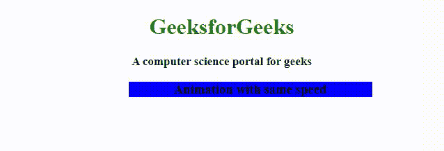

# 如何使用 CSS 以同样的速度从头到尾播放动画？

> 原文:[https://www . geesforgeks . org/how-play-动画-从头到尾用同样的速度使用-css/](https://www.geeksforgeeks.org/how-to-play-animation-from-start-to-end-with-same-speed-using-css/)

本文的方法是学习如何使用 CSS 中的 **[动画-计时-函数属性](https://www.geeksforgeeks.org/css-animation-timing-function-property/)** 来播放从头到尾具有相同速度的动画。它用于指定动画如何通过关键帧进行过渡。也就是说，它用于指定过渡期间动画的运动。

**语法:**

```css
animation-timing-function: linear; 
```

**例 1:**

```css
<!DOCTYPE html>
<html>

<head>
    <style>
        .geeks {
            font-size: 40px;
            text-align: center;
            font-weight: bold;
            color: white;
            padding-bottom: 5px;
            font-family: Times New Roman;
        }

        .geeks1 {
            font-size: 17px;
            font-weight: bold;
            text-align: center;
            font-family: Times New Roman;
        }

        h3 {
            width: 350px;
            animation-name: text;
            animation-duration: 4s;
            animation-iteration-count: infinite;
            background-color: blue;
            text-align: center;
        }

        #two {
            animation-timing-function: linear;
        }

        @keyframes text {
            from {
                margin-left: 90%;
            }

            to {
                margin-left: 0%;
            }
        }
    </style>
</head>

<body>
    <center>
        <div class="geeks">
            GeeksforGeeks
        </div>

        <div class="geeks1">
            A computer science portal for geeks
        </div>
        <h2>
            How to play the animation with
            the same speed from start to end?
        </h2>
    </center>
    <!-- For this animation-timing-function
            will be set to linear -->
    <h3 id="two">
        Animation with same speed
    </h3>
</body>

</html>
```

**输出:**


例 2:

```css
<!DOCTYPE html>
<html>

<head>
    <style>
        div {
            width: 150px;
            animation-name: text;
            animation-duration: 4s;
            animation-iteration-count: 2;
            background-color: yellow;
        }

        #two {
            animation-timing-function: linear;
        }

        @keyframes text {
            from {
                margin-right: 100%;
            }

            to {
                margin-right: 0%;
            }
        }
    </style>
</head>

<body>
    <center>
        <h2 style="color:green">
            GeeksforGeeks
        </h2>

        <!-- For this animation-timing-function
            will be set to linear -->
        <div id="two">
            GeeksForGeeks
        </div>
    </center>
</body>

</html>
```

**输出:**


**支持的浏览器:**

*   谷歌 Chrome
*   微软公司出品的 web 浏览器
*   火狐浏览器
*   歌剧
*   旅行队