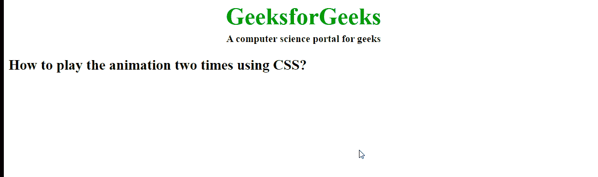

# 如何使用 CSS 将动画精确播放两遍？

> 原文:[https://www . geeksforgeeks . org/如何使用-css/](https://www.geeksforgeeks.org/how-to-play-the-animation-exactly-two-times-using-css/) 精确播放动画两次

本文的方法是使用 CSS 中的**动画-迭代-计数属性**将动画精确播放两次。它用于指定动画重复的次数。它可以指定为无限来无限重复动画。

**语法:**

```html
animation-iteration-count: number | infinite | initial | inherit; 

```

**示例:**下面的代码用于将< h2 >元素的背景颜色从红色更改为蓝色。

## 超文本标记语言

```html
<!DOCTYPE html> 
<html>

<head> 
    <style> 
        .geeks { 
            font-size: 40px; 
            text-align:center; 
            font-weight:bold; 
            color:#090; 
            padding-bottom:5px; 
            font-family:Times New Roman; 
        } 

        .geeks1 { 
            font-size:17px; 
            font-weight:bold; 
            text-align:center; 
            font-family:Times New Roman; 
        } 

        #one { 
            animation-name: example; 
            animation-duration: 2s; 
            /* Animation will be repeated twice */ 
            animation-iteration-count: 2; 
        } 

        @keyframes example { 
            from { 
                background-color: red; 
            } 
            to { 
                background-color: blue 
            } 
        } 
    </style> 
</head> 

<body> 
    <div class = "geeks"> 
        GeeksforGeeks 
    </div> 

    <div class = "geeks1"> 
        A computer science portal for geeks 
    </div> 

    <!-- Animation of the text inside the 
        h2 tag below will be repeated twice only -->
    <h2 id="one"> 
        How to play the animation 
        two times using CSS? 
    </h2> 
</body> 

</html>
```

**输出:**



**支持的浏览器:**

*   谷歌 Chrome
*   微软公司出品的 web 浏览器
*   火狐浏览器
*   歌剧
*   旅行队