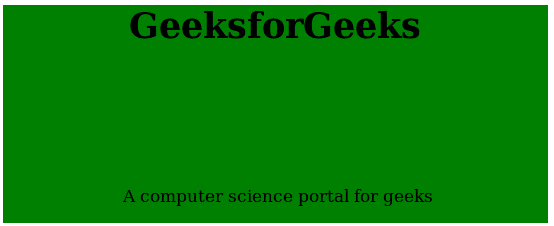

# 如何使用 CSS 将 div 定位在其容器底部？

> 原文:[https://www . geesforgeks . org/how-to-position-a-div-在其容器底部使用-css/](https://www.geeksforgeeks.org/how-to-position-a-div-at-the-bottom-of-its-container-using-css/)

在容器底部设置 div 的位置可以使用 bottom 和 position 属性来完成。将位置值设置为绝对值，将底部值设置为零，以便在容器底部放置一个 div。
位置属性可以取多个值，如下所示:

*   **绝对:**当除法的位置相对于其父除法时，使用该属性(在本例中使用)。
*   **相对:**当一个分区相对于屏幕上其他组件的位置时，使用该属性。
*   **固定:**当一个组件的位置固定在屏幕上而不考虑其他 HTML 组件(如页脚注释)时，使用该属性。

position 属性以及属性，如左、右、上和下，可以用来显示适当的位置。

**例 1:**

```css
<!DOCTYPE html>
<html>
    <head>
        <title>Position a div at bottom</title>
        <style>
            .main_div {
                text-align:center;
                position: relative;
                left: 100px;
                height: 200px;
                width: 500px;
                background-color: green; 
            }
            .sub_div {
                position: absolute;
                bottom: 0px;
            }
            p {
                margin-left:110px;
            }
        </style>
    </head>
    <body>
        <div class="main_div">
            <h1>GeeksforGeeks</h1>
            <div class="sub_div"> 
                <p>A computer science portal for geeks</p>
            </div>
        </div>
    </body>    
</html>               
```

**输出:**


**示例 2:** 在本例中，使用表格在正文底部显示内容。top 和 bottom 属性用于将内容设置在顶部和底部位置。

```css
<!DOCTYPE html>
<html>
    <head>
        <style>
            html, body {
                height: 100%;
                background-color:green;
            }
            .main_div {
                height: 100%;
                width:100%;
                border-collapse: collapse;
            }
            h1, p {
                text-align:center;
            }
            * {
                padding: 0;
                margin: 0;
            }
        </style>
    </head>
    <body>
        <table class="main_div">
            <tr>
                <td valign="top"><h1>GeeksforGeeks</h1></td>
            </tr>
            <tr>
                <td valign="bottom"><p>A computer science 
                portal for geeks</p></td>
            </tr>
        </table>
    </body>
</html>
```

**输出:**


HTML 是网页的基础，通过构建网站和网络应用程序用于网页开发。您可以通过以下 [HTML 教程](https://www.geeksforgeeks.org/html-tutorials/)和 [HTML 示例](https://www.geeksforgeeks.org/html-examples/)从头开始学习 HTML。

CSS 是网页的基础，通过设计网站和网络应用程序用于网页开发。你可以通过以下 [CSS 教程](https://www.geeksforgeeks.org/css-tutorials/)和 [CSS 示例](https://www.geeksforgeeks.org/css-examples/)从头开始学习 CSS。