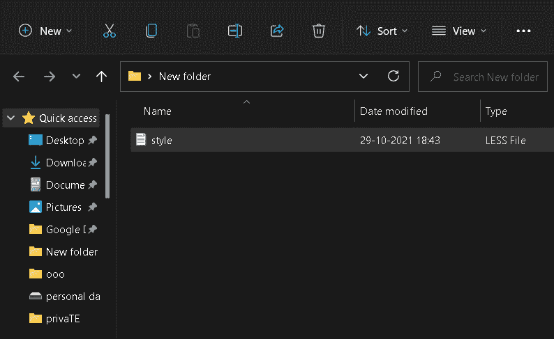
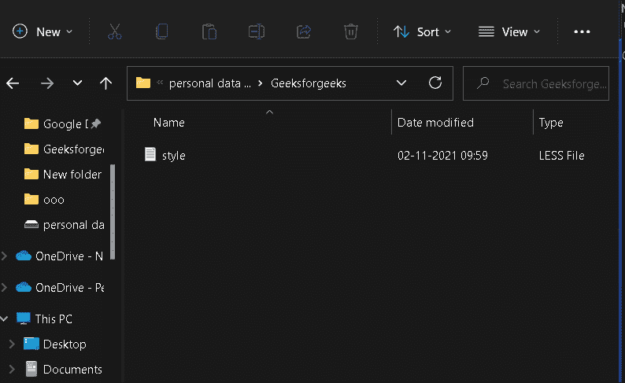
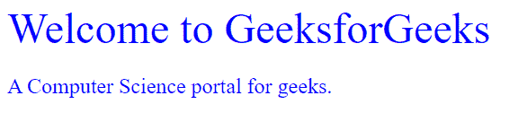

# 如何将 LESS 预编译成 CSS？

> 原文:[https://www . geeksforgeeks . org/预编译成 css 的方法/](https://www.geeksforgeeks.org/how-to-pre-compile-less-into-css/)

在本文中，我们将讨论如何将 LESS 文件预编译成 CSS 文件&将通过示例了解它的实现。

**简介:** LESS 是一个简单的 CSS 预处理器，可以为网站创建可管理、可定制和可重用的样式表。LESS 是 CSS 向后兼容的语言扩展，以及增加 CSS 工作能力的动态样式表语言特性。它允许使用变量，并提供编程语言的功能。但是如果我们想在网页上使用 LESS 之前将其预编译成 CSS，我们可以通过使用 npm 包管理器的 LESS 包来实现。这样，我们就可以用更少的投入制作一个简单的 HTML 网页。

**配置 LESS 将其预编译为 CSS:** 我们可以使用以下命令从 [npm](https://www.npmjs.com/package/less) 安装 LESS 包的最新版本。在我们运行以下命令之前，必须在系统上安装 node.js。详细安装过程请参考 [Node.js NPM(节点包管理器)](https://www.geeksforgeeks.org/node-js-npm-node-package-manager/)一文。现在，运行下面的命令来全局安装 LESS 编译器。

**语法:**

```css
npm install less -g
```

**注意:**如果安装过程中因为权限问题出现问题，请以管理员身份运行命令提示符。

**将 LESS 预编译成 CSS:** 要将 LESS 编译成 CSS，我们在命令提示符下使用下面的命令。命令让我们将 LESS 文件预编译成一个基本的 CSS 文件。这有助于我们使用 LESS 编程编写模块化代码，并通过将其编译成传统的快速 CSS 来获得 CSS 的所有好处。

**语法:**

```css
lessc <source> [destination]
```

哪里，

*   **<来源>:**LESS 文件的完整名称，地址来自当前工作目录。
*   **【目的地】:**所需 CSS 文件的完整名称，地址来自当前工作目录。

**示例 1:** 如果我们在当前工作目录中有一个文件 *style.less* ，并且我们想将其编译成一个 CSS 文件作为同一目录中的 *style.css* 。我们使用以下命令:

```css
lessc style.less style.css
```

该命令将 LESS 文件 *style.less* 转换为 CSS 文件 *style.css* 。

**LESS 文件:**

```css
.container {
   .base-container {
       font-size: 24px;
   }
   .base2-container {
       font-size: 48px;
   }
}
```

**CSS 文件:**

```css
.container .base-container {
 font-size: 24px;
}
.container .base2-container {
 font-size: 48px;
}
```

**输出:**



输出

**示例 2:** 如果我们在另一个目录中有一个文件 *style.less* (在这种情况下，它在“D:\Geeksforgeeks”中)，而不是在当前目录中，我们希望将其编译成一个 CSS 文件，作为同一目录中的 *style.css* 。我们使用以下命令:

```css
lessc D:\Geeksforgeeks\style.less D:\Geeksforgeeks\style.css
```

该命令将 LESS 文件 *style.less* 转换为 CSS 文件 *style.css* 。

**LESS 文件:**

```css
@primary-color: #0000ff;
@padding: 4px;
.container {
   .base-container {
       font-size: 24px;
       padding-right: round(@padding);
       color: @primary-color;
   }
   .base2-container {
       font-size: 48px;
       padding-right: round(@padding);
       color: @primary-color;
   }
}
```

**CSS 文件:**

```css
.container .base-container {
 font-size: 24px;
 padding-right: 4px;
 color: #0000ff;
}
.container .base2-container {
 font-size: 48px;
 padding-right: 4px;
 color: #0000ff;
}
```

**输出:**



输出

**示例**:在这个示例中，我们使用了上面生成的从 LESS 预编译的 CSS 代码。

## 超文本标记语言

```css
<!DOCTYPE html>
<html>

<head>
    <title>LESS Tutorial</title>
    <style>
    .container .base-container {
        font-size: 24px;
        padding-right: 4px;
        color: #0000ff;
    }

    .container .base2-container {
        font-size: 48px;
        padding-right: 4px;
        color: #0000ff;
    }
    </style>
</head>

<body>
    <div class="container">
        <div class="base2-container">
            Welcome to GeeksforGeeks
        </div>
        <p class="base-container">
            A Computer Science portal for geeks.
        </p>
    </div>
</body>

</html>
```

**输出:**

